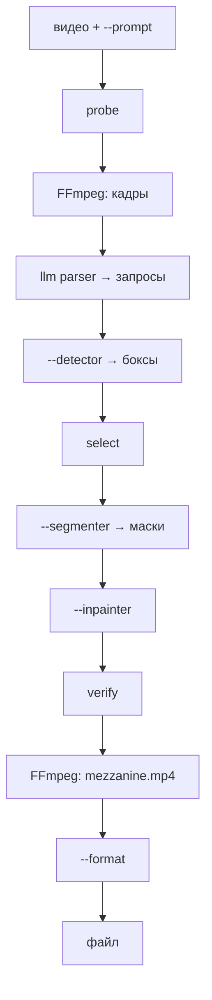

# videoclean

По `--prompt` находит в видео названный объект (логотип, надпись, кружку), строит маску и заливает область. CLI: Python, `uv`, FFmpeg.

```bash
uv sync
uv run videoclean backends
uv run videoclean doctor
uv run videoclean run --help
```

`--prompt` обязателен. Веса Hugging Face качаются только с `--download-models` или заранее через `huggingface-cli download`.

## Пайплайн

`videoclean run` идёт по стадиям. На CPU и CUDA порядок тот же.



LLM parser достаёт из `--prompt` короткие запросы (`red mug`, `channel logo`). Detector ищет их на кадрах. Select оставляет нужный экземпляр (`where`, «третья слева»). Segmenter режет маску, inpainter заливает. `verify` ещё раз гоняет detector; `--no-verify` выключает. `--prompt` обязателен.

`--device` задаёт устройство для Grounding DINO, OWL-ViT, SAM2, LaMa и ProPainter. `opencv-telea` всегда на CPU. FFmpeg читает и пишет файлы на любой машине.

## Флаги

| Флаг | Что делает | Значения |
|---|---|---|
| `--device` | устройство нейросетей | `cpu`, `cuda`, `mps` |
| `--detector` | запросы → боксы | `grounding-dino` (по умолчанию), `owlvit`; цепочка через запятую |
| `--detector-model` | id модели на Hugging Face | `google/owlvit-base-patch32`, `IDEA-Research/grounding-dino-tiny` |
| `--detector-threshold` | порог бокса, без скрытого пола | по умолчанию `0.15` для grounding-dino и owlvit |
| `--mask-dilate` | расширение SAM-маски | по умолчанию `3` px |
| `--telea-radius` | радиус TELEA | по умолчанию `9` |
| `--min-mask-coverage` | минимум доли маски | по умолчанию `0.0004` |
| `--verify-max-coverage` | потолок leftover для второго inpaint | по умолчанию `0.12` |
| `--segmenter` | боксы → маски | `sam2`, `sam2-video` |
| `--segmenter-model` | id SAM2 | `facebook/sam2-hiera-tiny` |
| `--inpainter` | заливка маски | `opencv-telea`, `lama`, `propainter` |
| `--inpainter-model` | веса ProPainter | `camenduru/ProPainter` |
| `--llm` | где крутится LLM parser | `auto`, `local`, `cloud` |
| `--llm-model` | тег Ollama (`llama3.2`, `llava-phi3`), id API или `.gguf` | |
| `--llm-base-url` | корень OpenAI-compatible `/v1` | |
| `--prompt-frame-stride` | vision-parse: кадр 0, потом каждый N-й (`4` → 0,4,8…). `0` = только текст | по умолчанию `4` |
| `--prompt-frame-max` | потолок кадров в vision LLM | по умолчанию `8` |
| `--vision-batch` | кадров на один vision-запрос. llava-phi3 — строго `2` | по умолчанию `2` |
| `--prompt-templates` | каталог со своими промптами (`system.md`, `vision_system.md`, `bridge_system.md`) | встроенные |
| `--detector-keyframes` | сколько кадров реально детектить (остальные добирает трекинг) | dino `8`, owlvit `12` |
| `--detector-nms-iou` | схлопывание дублей боксов | по умолчанию `0.3` |
| `--detector-max-box-area` | отсечка боксов > доли кадра | по умолчанию `0.25` |
| `--tracker-min-score` | порог шаблонного трекинга | по умолчанию `0.55` |
| `--tracker-max-template-area` | потолок площади кропа для трекинга | по умолчанию `0.12` |
| `--propainter-*` | тюнинг ProPainter: `mask-dilation` `4`, `ref-stride` `10`, `neighbor-length` `10`, `subvideo-length` `80`, `raft-iter` `20` | см. docs/PARAMS.md |
| `--verify` / `--no-verify` | повторный детект | по умолчанию включён |
| `--format` | контейнер | `mp4`, `mov`, `mkv`, `webm`, `hls-fmp4`, `hls-ts`, `dash` |

Полный справочник с «когда крутить»: [docs/PARAMS.md](docs/PARAMS.md). Выбор моделей: [docs/MODELS.md](docs/MODELS.md).

Detector получает `Intent.queries` как есть (строки из JSON parser). Select оставляет трек, если `label` пересекается с `query`; `where` и `ordinal` режут уже найденное.

## `videoclean run`

```bash
uv run huggingface-cli download IDEA-Research/grounding-dino-tiny

uv run videoclean run \
  --input ./input.mp4 \
  --output ./output/cleaned.mp4 \
  --prompt "убери надписи" \
  --llm local \
  --llm-model llama3.2 \
  --device cpu \
  --detector grounding-dino \
  --segmenter sam2 \
  --inpainter opencv-telea \
  --overwrite
```

`sam2` идёт через `transformers>=4.56` (на Intel Mac с torch 2.2.2 это ок). `sam2-video` — пакет facebookresearch/sam2 и обычно torch≥2.5 (на Intel Mac официальных колёс torch≥2.3 нет). `lama` — `uv sync --extra lama` и `big-lama.pt`. ProPainter рассчитан на CUDA. Что реально поднимется: `uv run videoclean doctor`.

Если detector не набрал `--detector-threshold`, `run` завершается ошибкой: объектов по промпту нет.

## Parser

После extract кадров parser смотрит `--prompt` и (если `--prompt-frame-stride > 0`) сэмпл кадров. Vision-модель (например Ollama `llava-phi3`) собирает тот же JSON `targets[]`; при ошибке/без vision — fallback на текстовую модель (`llama3.2`). Место модели: `--llm local|cloud|auto`.

```bash
# ollama serve && ollama pull llama3.2
uv run videoclean run \
  --input ./input.mp4 \
  --output ./output/cleaned.mp4 \
  --prompt "убери кружку на столе и логотип канала, прицел не трогай" \
  --llm local \
  --llm-model llama3.2 \
  --overwrite
```

GGUF: `uv sync --extra local-llm` и `--llm-model /path/to/model.gguf`.

Облако: `XAI_API_KEY` + `--llm cloud --llm-model grok-4.5`, либо `OPENAI_API_KEY` / `VIDEOCLEAN_LLM_API_KEY` и `--llm-base-url https://api.openai.com/v1`.

`--llm auto` выбирает local при локальном URL или `.gguf`, иначе cloud при наличии ключа.

## CUDA

Python 3.11, NVIDIA:

```bash
uv sync --extra gpu
uv pip install torch torchvision --index-url https://download.pytorch.org/whl/cu124
uv pip install 'transformers>=4.51'

uv run huggingface-cli download facebook/sam2-hiera-tiny
uv run huggingface-cli download IDEA-Research/grounding-dino-tiny
git clone --depth 1 https://github.com/sczhou/ProPainter.git ~/.videoclean/vendor/ProPainter
uv run huggingface-cli download camenduru/ProPainter \
  --local-dir ~/.videoclean/weights/propainter

uv run videoclean doctor --device cuda --detector grounding-dino --segmenter sam2-video --inpainter propainter

uv run videoclean run \
  --input ./input.mp4 \
  --output ./output/cleaned.mp4 \
  --prompt "убери логотип снизу и надпись справа сверху" \
  --llm local \
  --llm-model llama3.2 \
  --device cuda \
  --detector grounding-dino \
  --segmenter sam2-video \
  --inpainter propainter \
  --overwrite
```

Пути ProPainter: `VIDEOCLEAN_PROPAINTER_ROOT`, `VIDEOCLEAN_PROPAINTER_WEIGHTS`.

`--device mps` если `torch.backends.mps.is_available()`.

Уже очищенный файл в другой контейнер:

```bash
uv run videoclean package \
  --input ./output/cleaned.mp4 \
  --output ./output/cleaned \
  --format mkv,hls-ts,dash \
  --overwrite
```

## Веса

```bash
uv run huggingface-cli download google/owlvit-base-patch32
uv run huggingface-cli download IDEA-Research/grounding-dino-tiny
uv run huggingface-cli download facebook/sam2-hiera-tiny
uv run huggingface-cli download facebook/sam2-hiera-large
uv run huggingface-cli download camenduru/ProPainter \
  --local-dir ~/.videoclean/weights/propainter
```

Большой SAM2: `--segmenter-model facebook/sam2-hiera-large` (ориентир 24 GB VRAM).

## UI (FastAPI) и RunPod

Порт `7860` (`VIDEOCLEAN_PORT`). Логин HTTP Basic: `VIDEOCLEAN_UI_USER` + `VIDEOCLEAN_UI_PASSWORD` (пароль обязателен). Два экрана: рабочая (видео, prompt, параметры, история) и конфиг (doctor, модели по категориям).

```bash
uv sync --extra web
VIDEOCLEAN_UI_USER=admin VIDEOCLEAN_UI_PASSWORD=change-me \
  uv run videoclean serve --host 127.0.0.1 --port 7860
```

Внешний API (тот же процесс): `POST /api/jobs` multipart `video` + `prompt`, статус `GET /api/jobs/{id}`, файл `GET /api/jobs/{id}/output`. Заголовок `Authorization: Bearer $VIDEOCLEAN_API_TOKEN` (если токен не задан, сработает пароль UI). Карта: `GET /api`.

Docker и деплой на RTX 4090: [docs/RUNPOD.md](docs/RUNPOD.md). Веса Hugging Face в образ не входят — качаются с экрана Конфиг после старта.

## Код

```
videoclean/domain/          Intent, Track, форматы
videoclean/application/     порты и use case
videoclean/adapters/        ffmpeg, grounding_dino, owlvit, sam2, sam2_video, opencv-telea, lama, propainter
videoclean/composition.py   флаг CLI → класс адаптера
videoclean/cli.py           Typer
```

Новый адаптер: класс в `adapters/`, регистрация в `composition.py` и `application/config.py`.
