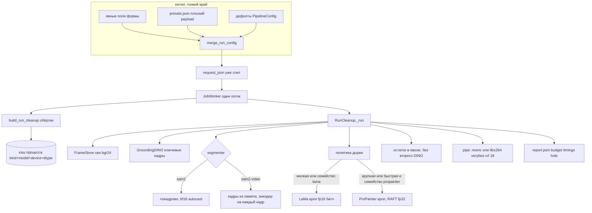
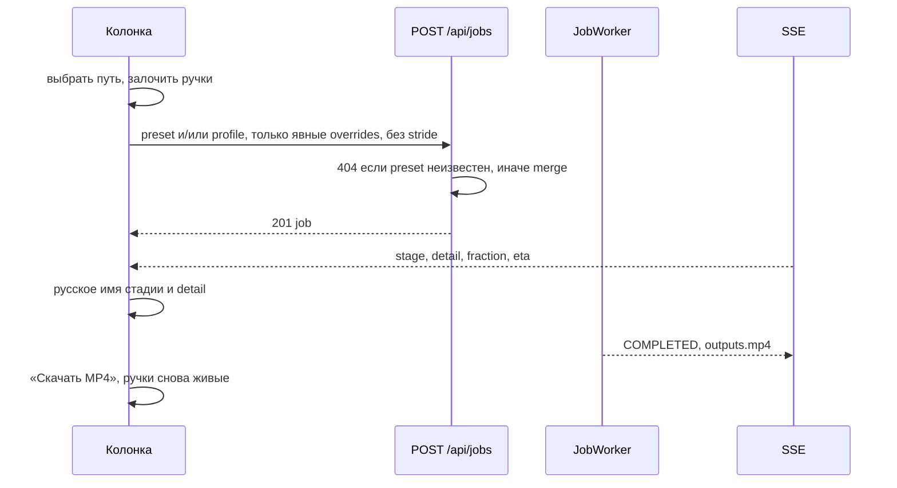

# Полная загрузка машины и обычный редактор VideoClean

| | |
|---|---|
| Author | — |
| Date | 2026-09-24 |
| Status | Draft |
| Audience | инженеры, которые будут внедрять это в `videoclean/`, `server/`, `webui/` |

## Overview

Сейчас прогон устроен так, будто 24 ГБ GPU — это осторожный режим. `PipelineConfig.device` и `serialize_clean_form` по умолчанию ставят `cpu`. `resolve_workers` на CUDA возвращает 1. LaMa гоняет полный кадр в fp32, по одному. ProPainter ресайзит дырку только до кратного 8 и считает почти нативный 1080p/4K. `sam2-video` перед `init_state` пишет каждый кадр во временный JPEG. Проверка по умолчанию заново гоняет GroundingDINO и SAM. Мезонин собирается из JPEG через `libx264 -preset medium`. Модели создаются заново в `build_run_cleanup` на каждый job и нигде не живут в процессе.

Редактор при этом показывает конвейер из пяти станций, три способа запустить удаление и результат, который начинается с конвертации, а не с MP4. Пресет пишется в `data_dir/presets.json` формой `{detect, run, advanced}` и job его не читает. Выбор профиля в `apply_profile` затирает собственные ключи профиля даже если их прислали явно — вопреки docstring.

Этот документ задаёт один движок на всю машину и один обычный редактор. Профили `fast` / `balanced` / `quality` остаются рецептами картинки. Единственный осознанный тормоз — потолок ресурсов, по умолчанию пустой. Дырка заливается кропом, который растёт до потолка памяти, а не полным кадром «потому что качество».

## Background & Motivation

Продукт удаляет текст, логотип или предмет из видео по фразе и/или мазкам. Один и тот же контракт у CLI, `POST /api/jobs` и WebUI. Ограничения окружения: HTTP `7860`, auth обязателен, веса не вшиты в образ, SQLite нельзя класть на network volume, первый запрос процесса платит загрузкой моделей один раз. Минимум GPU — 16 ГБ (`grounding-dino-tiny` + `sam2-hiera-tiny` + LaMa). 24 ГБ — класс, на котором временная заливка не должна падать по OOM.

Боль, которую нельзя оставить «на потом»:

- Горячий путь `RunCleanup._run` (`videoclean/application/use_cases/run_cleanup.py`) делает `extract_frames` → JPEG `q:v 2` → `LazyFrames` → покадровый `write_image` инпейнта → `encode_mezzanine` снова из JPEG. Плюс второй JPEG-дамп в `Sam2VideoSegmenter._propagate`.
- `LamaInpainter.inpaint` кормит сети весь кадр. `ProPainterInpainter._run` ставит `process_w/h = orig - orig % 8` и на каждом вызове делает `.half()` модулям, включая путь после RAFT.
- `verify` при `verify_max_passes >= 1` всегда вызывает `_discover` и `_segment_masks` по уже залитым кадрам. Для рецепта `balanced` это второй полный проход детектора. `masks_override` verify пропускает — это остаётся.
- `build_run_cleanup` собирает новые адаптеры на job. Веса живут в `self._model` экземпляра и умирают вместе с ним. Прогретый процесс этому не помогает.
- `POST /api/jobs` не принимает `preset`. `save_preset` только добавляет запись. `pipeline_config_from_dict` вызывает `apply_profile`, который перезаписывает `PROFILE_KEYS`.
- WebUI: `presetSnapshot` кладёт `{detect, run, advanced}`. `StageRail` в статусе прогона показывает проценты и ETA, но не `progress.detail`, хотя клиент его уже хранит (`InpaintProgress.detail`, `job.detail`). `ResultPanel` открывается переключателями форматов, по умолчанию включён webm. Скачивание в библиотеке — сырой `<a href>`, не `downloadJobOutput`. Пустой кадр разметки пишет «Маска сохранена». `interpret.result.prompt` — это английский `out_prompt` из `BuildPrompt` (`report.prompt`), и эффект в `stage-rail.tsx` подставляет его в то же поле, где лежит фраза пользователя. `runAll` в `workspace/index.tsx` делает то же самое.
- `keep_workdir` в `DEFAULT_PARAMS` равен `true`, на сервере — `false`. На поде это оставляет JPEG всего ролика.

Отвергнутый черновик вводил группу «Скорость» и трактовал `fast` / `balanced` / `quality` как способы выдать или придержать GPU. Это не делаем. Не подменяем русскую фразу пользователя английской строкой LLM в том же textarea. Не гоняем ProPainter в нативном полном кадре. Не оставляем JPEG-дамп `sam2-video`. Не делаем вторую полную детекцию проверкой по умолчанию. Не ведём экран результата конвертацией в WebM.

## Goals & Non-Goals

### Goals

- Пустой потолок ресурсов означает «взять машину»: лучшее устройство (`cuda`, иначе `mps`, иначе `cpu`), все свободные потоки CPU, заливка до потолка VRAM.
- Рецепты картинки не меняют долю GPU. Явное поле запроса побеждает ключ профиля, ключ профиля побеждает поле пресета, пресет побеждает серверный дефолт.
- Дырка малого размера — LaMa кропом, fp16, батч, растушеванная вставка. Крупная или быстрая — ProPainter по этому кропу на максимальной рабочей стороне, которая влезает. RAFT остаётся fp32.
- `sam2-video` читает кадры из памяти. Превью может остаться покадровым `sam2`.
- Проверка по умолчанию — остаточные пиксели внутри маски и перезаливка грязных диапазонов.
- Обычный редактор: сценарий, «Убрать», MP4, без абзацев-инструкций. Эксперт — тумблер, ручки у станции работы.
- Пресет — плоский мешок тех же полей, что уже понимает форма job, плюс потолки. Старый UI-блоб читается. Неизвестный пресет — HTTP 404.
- Отчёт job и `doctor` доказывают, что хост не простаивал.
- На классе 24 ГБ, прогретый процесс, рецепт `balanced`, ролик SLA — не дольше 120 с и не хуже сегодняшней полнокадровой LaMa на этом рецепте.

### Non-Goals

- Новая группа настроек «Скорость» или профиль, который «включает скорость».
- Смена дефолта на медленный или на неполный GPU.
- `hiera-large` как дефолт. NVENC как зависимость.
- Хранение в пресете фразы, видео, источника, масок, треков, webhook и шага осмотра.
- Редизайн `webui/src/shared/ui/*`. Новые абзацы-подсказки. WebSocket. Импорт `server` из `videoclean`.
- Браузерный скриншот-сьют.
- Обещание 120 с для CPU, 4K, 60 fps или дырки почти на весь кадр.
- Автоматическое снижение `propainter_raft_iter` ниже 20. Замера, что качество держится, нет; ручка остаётся рядом с остальными полями ProPainter, дефолт 20.
- Перевод `balanced` на `sam2-video` ради укладки в SLA. Это другой рецепт маски. Если стадия `segment` не влезает в бюджет ниже, это видно в отчёте, рецепт молча не подменяется.

## Key Decisions

1. **Один merge, один объект конфига.** Новых параллельных UI-блобов нет. Итог — `PipelineConfig` плюс три потолка и `verify_redetect`. Сборка — `merge_run_config` в `videoclean/application/profiles.py`. В `request_json` пишется уже слитый словарь. `pipeline_config_from_dict` больше не вызывает `apply_profile`: повторный вызов снова затёр бы явные ключи. `explicit` — это только ключи, которые форма или CLI реально прислали, снятые *до* `serialize_clean_form`. Сегодня `serialize_clean_form` подставляет `device=cpu` и остальные дефолты (`mask_dilate_px or 3`, `profile or "custom"`); этот словарь нельзя считать слоем explicit. Функция либо перестаёт заполнять отсутствующие ключи, либо job-путь её для merge не вызывает. Тот же набор explicit собирает `composition.config_from_flags` в том же PR, что и merge: источник флага — `ParameterSource.COMMANDLINE`. Пока WebUI шлёт весь `toRunParams`, merge небезопасен: этот клиент меняется в том же PR, не в редакторе следом.
2. **`device=auto` резолвится до рецепта, и только вместе с кропом.** Пустая строка и `auto` → `cuda`, иначе `mps`, иначе `cpu` (та же проверка, что `server.service.default_device`). В `PipelineConfig.device` попадает уже `cpu|cuda|mps`. Строка `auto` до `validate()` не доходит: `validate()` по-прежнему принимает только `cpu|cuda|mps`. В отчёте отдельно лежит `deviceRequested`. Резолв, который может выбрать CUDA-ветку `quality` (`sam2-video` + `propainter`), входит в тот же PR, что и политика дырки. До этого коммита отсутствующее устройство остаётся серверным дефолтом `cpu` и *не* записывается в explicit как `cpu`: иначе поздний `auto` уже не пробьётся. С того коммита, где `auto` выбирает CUDA, `quality` на CUDA больше не гоняет полный кадр ProPainter.
3. **Порядок слияния жёсткий.** Серверные дефолты → поля пресета → ключи `PROFILE_KEYS` выбранного встроенного профиля на уже известном устройстве → явные поля формы/CLI. Слой профиля применяется только для `fast|balanced|quality`. `custom` и отсутствие профиля этот слой пропускают (`profile_defaults("custom")` не вызывается: сегодняшняя функция бросает `ValueError`). Неизвестное имя профиля — HTTP 400, не тихий `custom`. Пример: пресет `inpaint_workers=4`, запрос `profile=quality` без явного workers — побеждает значение профиля. Пример наоборот: явный `mask_dilate_px=8` при `profile=quality` остаётся 8. Пример, который легко прочитать наоборот: пресет сам хранит `profile=quality` и `mask_dilate_px=8`, job не присылает dilate — 8 мёртв, побеждает рецепт (5). Ключи `PROFILE_KEYS` внутри пресета с встроенным именем профиля не перебивают этот профиль. Чтобы сохранить 8, пресет пишется как `profile=custom` либо job присылает поле явно. UI при расхождении со встроенным сценарием сохраняет `custom`, а не имя рецепта рядом с чужим dilate.
4. **Членство `PROFILE_KEYS` не меняется.** Туда по-прежнему входят `verify`, `verify_max_passes`, `detector_keyframes`, `mask_dilate_px`, `segmenter`, `inpainter`, `inpaint_workers`, `inpaint_chunk_overlap`, `propainter_subvideo_length`. В PR движка значение `inpaint_workers` у всех трёх рецептов становится `0` (авто под потолком). Сейчас `quality` на CUDA пишет `1` — это тормоз GPU, не рецепт картинки. Ключ в наборе остаётся, чтобы выбор профиля по-прежнему перезаписывал именно его.
5. **Потолки не входят в `PROFILE_KEYS`.** `max_vram_mb`, `cpu_threads`, `inpaint_max_side` — `int | None`. `None` / отсутствие поля = потолка нет. `0` для этих трёх — ошибка валидации, не «авто». `inpaint_workers=0` остаётся авто, чтобы не ломать уже сохранённые формы.
6. **Авто-воркеры полного кадра не раздуваем до PR движка.** Пока LaMa читает весь кадр, GPU-авто остаётся 1, как `resolve_workers` сегодня. Иначе PR потолков устроит OOM раньше, чем появится кроп-батч. Этот PR не переключает дефолт устройства на CUDA: иначе `quality` без явного `device` выберет сегодняшнюю ветку `sam2-video` + полный кадр ProPainter. С PR движка авто на GPU — это размер батча кропов под потолок, а не пул процессов с копиями весов. ProPainter (`video_aware`) по-прежнему один поток: освободившуюся память забирает рабочая сторона, не второй RAFT.
7. **Семейство инпейнтера задаёт рецепт, политику дырки исполняет движок.** `inpainter=lama` (fast, balanced, quality на CPU) — только LaMa, даже если дырка крупная, но сторона кропа всё равно упирается в потолок. `inpainter=propainter` на CUDA — мелкие дырки всё равно LaMa-кропом; крупные или быстрые — ProPainter по кропу. Имя в конфиге не переписывается. Отчёт различает `inpainter` и `hole.policy`. ProPainter не грузится, если ни один кадр его не попросил.
8. **Пороги дырки — константы движка, не слайдеры.** Доля — это пиксели маски, не площадь bbox: `count_nonzero(mask) / mask.size` по объединению масок кадра. Bbox нужен только как геометрия кропа. Мелкая: средняя доля `< 0.08` и медиана максимальной стороны bbox `< 0.35` кадра, и дырка не быстрая. `motions` — одна метка на трек, не на кадр. Быстрая: у любого трека `motion=floating` (`infer_motion`, порог 0.025, меньше трёх точек → `static`) или медианный сдвиг центра *объединённого* bbox соседних кадров `> 0.04` диагонали. Почти весь кадр: средняя доля пикселей `≥ 0.55` или сторона объединённого bbox `≥ 0.85` по обеим осям. `plan_holes` возвращает список планов диапазонов, не один план на ролик. Контекст LaMa: `max(32, 0.5 * max(bw, bh))` px. Перо вставки: 16 px, но не больше `side/8`. Сторона кропа кратна 8.
9. **RAFT iters остаются 20.** Снижать дефолт нельзя, пока нет замера качества. `propainter_raft_iter` по-прежнему явное поле рядом с `propainter_neighbor_length`.
10. **dtype.** fp16 для LaMa — режим, который проба подтвердила, а не обещание. На CUDA после `torch.jit.load` один forward 64×64 батчем 2: сначала попытка `model.half()`, затем forward. Любое исключение (у `big-lama.pt` это `reflection_pad2d` / `Half`, не только NaN) или нефинитный выход фиксирует запись кэша на fp32, `hole.lamaDtype=fp32`. Повтор батча в fp32 делается на той же пробе, не откладывается до NaN в бою. CPU и MPS half не пробуют и остаются fp32. CUDA ProPainter: в том же PR, где модуль попадает в кэш, `.half()` один раз только у `flow_complete` и `InpaintGenerator`. RAFT и его входы остаются fp32. Вызовы `.half()` внутри `_run` удаляются в этом же PR, не «потом в движке»: иначе второй job увидит уже скастованный RAFT или повторный half. Оба бэкенда SAM2 на CUDA: `torch.autocast("cuda", bf16)` вокруг forward. Веса SAM не кастуются в half. Transformers-путь сегодня без autocast (`_predict_transformers`); это дыра, её закрываем. GroundingDINO на CUDA: bf16 autocast только вокруг forward, постпроцесс боксов в fp32. Порог детектора не меняется.
11. **Кэш весов процесса.** Ключ `(kind, model_id, device, dtype)`. Обёртка адаптера по-прежнему создаётся на job (`build_run_cleanup`), но `_ensure` берёт модуль из кэша. `inference_state` SAM2 в кэш не кладётся. Воркер один (`JobWorker._loop`), гонки двух прогонов нет. Кэш не переживает процесс. Инвариант: закэшированный модуль не перекастовывается на каждый вызов.
12. **Горячий путь кадров — не JPEG.** Декод: `ffmpeg` rawvideo `bgr24` в mmap под `data_dir` (`frames.bgr`) либо окно LaMa, если сырой объём не влезает. Энкод мезонина: rawvideo в stdin из второго mmap или из окна, не из второго полного `list[ndarray]`. `h264_nvenc`, если пробник жив: `-c:v h264_nvenc -preset p4 -rc vbr -cq 18 -b:v 0` — без `-crf`. Иначе `-c:v libx264 -preset veryfast -crf 18`. MP4-пакет и сегодня `-c copy`. `keep_workdir` может сбросить JPEG/PNG для глаз, рабочий набор их не читает. Превью-JPEG и JPEG для vision-LLM в памяти остаются.
13. **Проверка.** Дефолт — `residual_unchanged_mask` + `dirty_ranges`, затем перезаливка тех же кропов, что и основной проход (`inpaint_masked` по `HolePlan` диапазона). `re_inpaint_ranges` больше не вызывает полнокадровые `inpaint_frames` / `inpaint_clip`. Второй GroundingDINO+SAM только при `verify_redetect=true`. Флаг не в `PROFILE_KEYS`. Поле живёт на `PipelineConfig` в том же PR, который принимает его в пресете и меняет цикл: иначе ключ либо 400, либо молча выбрасывается `pipeline_config_from_dict`. Рецепты поднимают `verify_max_passes` (fast `0`, balanced `1`, quality `2`), но не включают redetect. `masks_override` по-прежнему пропускает verify целиком.
14. **Пресет.** Чтение понимает старый `{detect, run, advanced}` и плоский объект. `detect` выбрасывается (там stride). Новые записи только плоские. `llm_api_key` в пресет не пишется и при миграции вырезается. `PUT /api/presets/{id}` меняет имя и/или payload, id стабилен. Дубликат имени — 409, пока нет `replace`. `preset=` на job ищет id, иначе точное имя; несколько строк с одним именем — 409 `ambiguous preset name`; нет строки — 404, без отката на дефолты.
15. **CLI отличает «флаг передан» от дефолта Typer.** Иначе все флаги выглядят явными и профиль никогда не применяется. Источник — `ParameterSource.COMMANDLINE` внутри `composition.config_from_flags`. Непереданный флаг не попадает в explicit. Дефолты Typer, которые не совпадают с `PipelineConfig`, перестают быть неявным explicit: `--detector-max-box-area` сегодня `0.25` в `cli.py` при `0.45` на `PipelineConfig` и в `_cv.MAX_BOX_AREA`. Непереданный флаг получает библиотечный `0.45`. Это сознательное выравнивание, его пишет PR merge, не побочный эффект. `--device` становится `auto` только в PR движка, вместе с кропом.
16. **Обычный UI не шлёт весь формуляр как явные поля, и это часть PR merge.** Иначе новый порядок заморозит рецепт: сегодняшний `toRunParams` шлёт `segmenter`, `inpainter`, dilate, verify, workers и ключи ProPainter, а пустой `device` `submitJob` выкидывает, после чего `serialize_clean_form` пишет `cpu`. На пустом устройстве клиентское зеркало `quality` — это CPU (`sam2` + `lama`), и эти поля как explicit убьют CUDA-рецепт. В том же PR появляется `explicitFields`: встроенный сценарий без правок шлёт `profile` и не шлёт ключи `PROFILE_KEYS`. Пресет шлёт `preset=<id>`. Разошедшиеся ручки и потолки уходят явно. `stride` на `kind=run` не уходит никогда. Пока старый `toRunParams` ещё постится, PR merge на под не ставится.
17. **Кадры на экране 1-based, по проводу 0-based.** Состояние `currentFrame`, имена масок `000000.png`, `eq(n,i)` и индексы боксов не перенумеровываем. Пользовательские цифры — `index + 1` (шапка уже так делает; лента — нет).
18. **`keep_workdir` в редакторе по умолчанию выключен.** Совпадает с сервером. Включение — только эксперт, станция «Устройство».
19. **Тестов мало и они про контракт.** Порядок merge, в том числе на payload сегодняшнего `toRunParams(DEFAULT_PARAMS)` без ключа `device`: при включённом `auto` и видимой CUDA устройство `cuda`, ключи `balanced` остаются рецептом, а не `cpu`. Плюс 404, миграция старого payload, пустой потолок = максимум, кроп/батч не выше потолка, ключи `inference_state` sam2. `tests/test_profiles_verify_inpaint.py::test_apply_profile_overwrites_owned_keys` переписывается под merge: явный `inpainter` побеждает `fast`, а не наоборот. Без браузера.
20. **Публичный контракт.** Поле `preset` живёт на уже публичном `POST /api/jobs`. CRUD пресетов переводится в Public. Остальные новые ручки job — поля той же формы, не новые URL.
21. **sam2-video питается копией `init_state`, а не пятиключевым словарём.** В `facebookresearch/sam2` на `main` нет `init_state_from_frames`. `reset_state` только чистит уже существующие ключи. Образ пинит коммит `2b90b9f5ceec907a1c18123530e92e794ad901a4` (HEAD `main` на 2026-09-24) в `Dockerfile`, `Dockerfile.api`. Приватный метод повторяет тело `SAM2VideoPredictor.init_state` этого коммита и подменяет только `load_video_frames`.
22. **Кандидат — один образ.** В нём одновременно движок кропа, merge с клиентом, который не шлёт полный формуляр, редактор и числовой чекер SLA. Более ранний PR — не выкладка движка и не повод смотреть, «заполнился ли GPU».

## Proposed Design

### Как устроен прогон



`videoclean` не импортирует `server`. Сервер резолвит пресет и вызывает `merge_run_config`. Воркер только поднимает `PipelineConfig` из уже слитого JSON.

Покадровые стадии внутри `_run` получают `Budget`, посчитанный один раз в начале job. Прогресс наружу остаётся на ключах `STAGES` из `videoclean/progress.py` (`validate`, `normalize`, `parse`, `detect`, `inpaint`, `verify`, `encode`, `package`, `report`). Более мелкие тайминги отчёта (`load`, `track`, `segment`) пишутся рядом, не новыми стадиями SSE: UI-веса и тексты стадий не переезжают.

### Устройство и потолок

Новый модуль `videoclean/application/budget.py`. Чистая функция плюс тонкий пробник torch/ffmpeg.

```python
@dataclass(frozen=True)
class Budget:
    device_requested: str
    device: str          # cpu | cuda | mps
    vram_total_bytes: int
    vram_free_bytes: int
    vram_ceiling_bytes: int | None  # None = не задан
    vram_budget_bytes: int          # сколько этому job можно занять
    cpu_count: int
    cpu_threads: int
    inpaint_workers_cap: int | None  # None = авто
    inpaint_max_side: int | None     # None = решит дырка
    nvenc: bool


RESERVE_BYTES = 1536 * 1024 * 1024


def resolve_budget(cfg: PipelineConfig, *, probe: MachineProbe) -> Budget:
    """Empty ceilings mean the whole machine. Never invent a smaller default."""
    ...
```

`resolve_budget` вызывается после того, как веса этого job уже резидентны (`get_or_load` детектора, сегментатора и тех инпейнтеров, которые семейство может вызвать: для `propainter` на CUDA это и ProPainter, и LaMa, потому что мелкие дырки остаются LaMa). Считать свободную VRAM до загрузки — значит запланировать батч в ту память, которую сейчас займут веса. `budget.warm` это не чинит: холодный и частичный кэш как раз такие.

Правила `vram_budget_bytes` по замеру *после* загрузки:

- CUDA: `free, total = torch.cuda.mem_get_info()`. Бюджет = `free - RESERVE_BYTES`. Если задан `max_vram_mb`, берётся минимум с этим потолком. Ниже 512 МБ после резерва — `PipelineError` с текстом, сколько свободно, а не тихий откат на крошечный батч.
- MPS: `mem_get_info` нет. `psutil` в `pyproject.toml` сейчас нет; PR, который вводит `resolve_budget`, добавляет его в `dependencies`. Пустой потолок = 60% `psutil.virtual_memory().total`. Заданный `max_vram_mb` режет это число. В отчёте `vramSource: "unified-estimate"`. Свой парсер `sysctl` не пишем.
- CPU: VRAM-бюджет 0. `cpu_threads` = поле или `os.cpu_count()`.

Потоки процесса: предыдущие `torch.get_num_threads()` и `cv2.getNumThreads()` запоминаются, новые ставятся на job, восстановление — в `finally` у `RunCleanup.execute` / воркера, в том числе на отмене и исключении. Очередь одна, но следующий job может принести другой потолок, а оборванный job не должен оставить урезанный процесс.

`inpaint_max_side` в бюджет только кладётся. Режет сторону кропа политика дырки. Это cap, не ускоритель: пустое поле не уменьшает сторону относительно того, что влезает в VRAM.

Пробник NVENC (`videoclean/adapters/media/ffmpeg.py`): разбор `ffmpeg -hide_banner -encoders` на `h264_nvenc`, затем пробный энкод 16×16 в `-f null` с аргументами nvenc из раздела кадров (без `-crf`). Кэш на процесс. Образ часто без NVENC — ожидаемый путь `libx264`. Отсутствие NVENC не warning уровня ошибки doctor.

`doctor` печатает снимок машины без job. Секция, которая сегодня называется `This command (independent flags, not a profile)`, переименовывается в `This command (resolved config)` в PR рецептов: профили существуют, осью скорости они не являются. До PR движка doctor не пишет `device=auto` как будто дефолт уже переключён.

### Кэш моделей

`videoclean/adapters/models/weights_cache.py`:

```python
@dataclass(frozen=True)
class WeightKey:
    kind: str       # grounding-dino | sam2 | sam2-video | lama | propainter
    model_id: str
    device: str
    dtype: str      # fp32 | fp16 | bf16-autocast

def get_or_load(key: WeightKey, loader: Callable[[], object]) -> tuple[object, bool]:
    """Return (module, loaded_now). loaded_now is false on a warm hit."""
```

Замок только вокруг загрузки. Адаптеры держат ссылку. Поля job, которые не входят в ключ (`threshold`, `dilate_px`, `raft_iter`, `neighbor_length`), остаются на обёртке.

`budget.warm` в отчёте — истина, только если каждый `WeightKey`, нужный этому job, уже был в кэше до первой стадии. SLA смотрит на это поле. Холодный старт в 120 с не обещается: это как раз «первый запрос после старта процесса».

Грузить в кэш заранее на старте `serve` не надо. Прогрев — первый реальный job или явный прогон. Иначе процесс без нужных весов упадёт на boot.

### Кадры: декод, память, энкод

Новый `videoclean/adapters/media/raw_store.py`. `FrameStore` даёт `__len__` и `__getitem__` → `ndarray` BGR uint8, как сегодня ожидают детектор и сегментатор.

Сырой объём bgr24: `n * h * w * 3`. Для SLA-ролика 1800×1920×1080×3 это 11 197 440 000 байт ≈ 10.4 ГиБ (не 11.2 ГиБ). Ворота диска считают не только этот файл.

В сумму, которую надо положить под `data_dir`, входят:

- `raw_bgr` — исходные кадры;
- `cleaned_bgr` — залитые кадры, второй mmap того же размера, либо окно, из которого сразу пишется stdin энкода (второго полного `list[ndarray]` нет: оригинал и заливка вместе — это ещё ~10.4 ГиБ сверх mmap);
- `mask_mmap` — `n * h * w` байт uint8, маски пишутся по мере сегментации, не копятся вторым списком массивов;
- `sam2_tensor`, только если сегментатор `sam2-video`: `n * 3 * image_size * image_size * 4` для float32, как у `load_video_frames`. При `image_size=1024` и 1800 кадрах это ≈ 21.1 ГиБ. Файл тензора лежит рядом с `frames.bgr`.

Диск — `shutil.disk_usage(data_dir)`. Если `data_dir` не на локальном диске контейнера (сетевой том, см. Rollout), job и doctor отказываются до mmap: большой том как раз пройдёт проверку «половина свободного» и положит SQLite-катастрофу плюс десятки гигабайт mmap. Это ошибка конфигурации, не запасной путь.

Если сумма влезает в половину свободного места локального диска — один набор mmap. Декод: `ffmpeg -i src -f rawvideo -pix_fmt bgr24 pipe:1`. Иначе для LaMa/ProPainter — окна не короче `propainter_subvideo_length + inpaint_chunk_overlap`. Детектор на ключевых кадрах декодирует только эти индексы в память. `sam2-video` окнами LaMa не живёт: propagate индексирует весь ролик. Если его тензор на локальный диск не влезает, job падает с `PipelineError` и числами байт. Молчаливый JPEG-каталог и усечённый propagate запрещены.

`LazyFrames` остаётся для превью. Прогон `kind=run` его для полного ролика не использует.

Энкод, замена `encode_mezzanine` для прогона. Ровно один из двух блоков видеокодека:

```text
ffmpeg -y -hide_banner
  -f rawvideo -pix_fmt bgr24 -s {w}x{h} -framerate {fps_ratio} -i pipe:0
  [-i src -map 1:a:0 -c:a aac -b:a 192k]
  -map 0:v:0 -frames:v {n} -pix_fmt yuv420p -movflags +faststart
  # nvenc, пробник прошёл:
  -c:v h264_nvenc -preset p4 -rc vbr -cq 18 -b:v 0
  # иначе:
  -c:v libx264 -preset veryfast -crf 18
  mezzanine.mp4
```

`-crf` на `h264_nvenc` не передаётся: для этой сборки флаг невалиден. Кадры в stdin читаются из mmap заливки или из окна. Аудио по-прежнему из исходника. `crop_clip` уже на `veryfast`; его выбор nvenc/x264 идёт тем же хелпером и тем же argv, геометрия кропа не меняется.

Пиксельный контракт мезонина: `yuv420p`, чётные стороны (уже есть в crop), CRF 18. `veryfast` вместо `medium` увеличивает файл, не задачу «дырка не хуже LaMa». Качество дырки определяется заливкой, не пресетом x264.

`keep_workdir=true`: после успешного энкода дополнительно пишутся `frames/`, `masks/`, `inpainted/` для просмотра глазами. Ошибка дампа не валит уже собранный MP4; в отчёт пишется `workdirDump: "failed"` и текст. `keep_workdir=false` удаляет mmap вместе с сегодняшними каталогами.

### Политика дырки

Новый `videoclean/application/hole_policy.py`. Чистые функции, без torch. Их и покрывает движковый unit-тест.

```python
@dataclass(frozen=True)
class RangePlan:
    start: int             # включительно
    end: int               # исключительно
    policy: str            # lama-crop | propainter-crop
    mean_coverage: float   # доля пикселей маски, не площадь bbox
    fast_moving: bool
    almost_full: bool
    side: int              # кратно 8
    batch: int             # верх, который план разрешил; фактический рост — по аллокатору
    feather_px: int
    context_px: int
    limited_by: str        # ceiling | frames | inpaint_max_side


def plan_holes(
    *,
    frame_hw: tuple[int, int],
    mask_coverage: list[float],          # len == frame_count, пиксели / площадь кадра
    mask_boxes: list[tuple[int, int, int, int] | None],
    track_motions: list[str],            # одна метка на трек
    union_centers: list[tuple[float, float] | None],
    family: str,                         # lama | propainter
    device: str,
    budget_bytes: int,
    inpaint_max_side: int | None,
) -> list[RangePlan]:
    ...
```

Соседние кадры одного семейства и одной стороны склеиваются в один `RangePlan`. Семейство кадра:

- конфиг `lama`, или устройство не CUDA, или дырка мелкая и не быстрая → `lama-crop`;
- конфиг `propainter`, устройство CUDA, и (дырка не мелкая или быстрая) → `propainter-crop`.

Почти полный кадр не меняет семейство, но `side` — максимум, который влезает, а не `min(w, h)`.

Формула байт — стартовая догадка для *первой* стороны, не источник истины для батча. `LAMA_ACT_FACTOR` нет: на 160 px множитель `S*S*3*2*8` даёт около мегабайта и попросит огромный батч до первого forward. ProPainter по-прежнему может прикинуть сторону так:

```text
bytes(side) = PROPAINTER_BYTES_AT_640 * (side / 640) ** 2
              * (neighbor_length / 10) * sqrt(subvideo_length / 80)
PROPAINTER_BYTES_AT_640 = 6 * 1024**3
```

Дальше решает аллокатор. Сторона кропа — минимальная, которая покрывает bbox+контекст, вверх до кратности 8, затем cap `inpaint_max_side`. Резерв уже вычтен внутри `vram_budget_bytes`. Проверка шага сравнивает дельту активации с этим бюджетом и **не** прибавляет `RESERVE_BYTES` второй раз.

Рост батча внутри диапазона длины `range_len`. `last` — последний успешный батч, старт `last = 1`.

1. Кандидат `nxt = min(last * 2, range_len)`. Голый `last * 2` дальше конца диапазона не предлагается: у SLA-ролика 1800 кадров, это не степень двойки.
2. `nxt == last` значит диапазон уже закрыт этим батчем. `limited_by=frames`, только потому что финальный `batch == range_len`.
3. Иначе оценить дельту активации на `nxt` по замерам `last` (линейно от уже измеренной дельты). Если оценка **выше** `vram_budget_bytes`, `nxt` не запускать.
4. Если оценка влезает — один forward. CUDA OOM на этом forward не означает «сразу записать ceiling на `last`».
5. И в случае шага 3, и в случае OOM на `nxt`, до записи `limited_by` пробуется середина: `mid = min((last + nxt) // 2, range_len)`. Это не `nxt // 2`: половина степени двойки снова попадает на уже успешный `last` и часто оказывается ниже 60 % бюджета. Если `mid > last`, один forward `mid`. Успех — финальный батч `mid`. Неуспех или `mid == last` — финальный батч остаётся `last`, в отчёт `hole.oomRetry=true`, если был OOM.
6. `limited_by=frames` тогда и только тогда, когда финальный батч равен `range_len`. Иначе, если упёрлись в бюджет или в неудачный больший шаг, `limited_by=ceiling`. Если сторону срезал именно заданный `inpaint_max_side`, а память ещё была, `limited_by=inpaint_max_side`.

Пустой cap — это `budget.inpaintMaxSide is null`. На SLA чекер требует ещё `hole.limitedBy != "inpaint_max_side"`. Поля `hole.inpaintMaxSide` нет.

`prepare_img_and_mask` по-прежнему делает `unsqueeze(0)` в батч 1. Батч собирается так: каждый кроп готовится отдельно, тензоры одной и той же пары `(H, W)` стакаются по dim 0. Разная сторона — разные шаги, в один forward их не мешают.

OOM LaMa при `last > 1` обрабатывается серединой из правила роста, не делением упавшего батча пополам. Если не влез уже `batch == 1`, сторона ×0.75 вниз до кратности 8, но не ниже 64, один повтор. В отчёт `hole.oomRetry=true`. Второй OOM после этого повтора — падение job. У ProPainter тот же один повтор по стороне ×0.75, когда батч кадров временной сети и так 1. NaN и исключение пробы dtype — отдельный путь (Key Decision 10), не этот retry.

Вставка: кроп кладётся в кадр mmap заливки с линейным пером по контуру маски. Пустая маска — кадр копируется без сети.

`inpaint()` остаётся для одного кадра и сам обязан кропать, если его позвали с маской. `RunCleanup` зовёт `inpaint_masked(frames, masks, plan)`. Метода нет, а политика дырки включена (любой `kind=run` после PR движка) — job падает сразу, до полного кадра. Дефолтной реализации «цикл `inpaint()` по целому кадру» у протокола нет.

Проверка идёт тем же путём: `re_inpaint_ranges` строит `plan_holes` на грязном диапазоне и зовёт `inpaint_masked`. Сегодняшний вызов `inpaint_frames` / `inpaint_clip` на исходных полных кадрах удаляется. Иначе рецепт `balanced` с `verify_max_passes=1` снова зальёт SLA-ролик полным кадром.

RAFT считается в fp32 на уже уменьшенных кадрах. Completion и generator — в том dtype, который зафиксировал кэш (fp16 на CUDA). Чанки длиннее `propainter_subvideo_length` режутся как сейчас, перекрытие — `inpaint_chunk_overlap`, но внутрь чанка уходит кроп, не полный кадр.

Пик заливки — дельта активаций, не счётчик, в котором всё ещё сидят веса. Сразу после `get_or_load` и `reset_peak_memory_stats()` запоминается `baseline = torch.cuda.memory_allocated()`. `reset_peak_memory_stats` не обнуляет аллокатор: пик становится равен текущему занятому, а это как раз веса. В отчёт:

- `budget.vramPeakLoadMb` — `baseline` в МиБ, только веса;
- `budget.vramPeakInpaintMb` — `(torch.cuda.max_memory_allocated()` после заливки минус `baseline)` в МиБ.

Чекер сравнивает эту дельту с `vramBudgetMb`. Складывать её с весами или вычитать резерв ещё раз нельзя: бюджет уже равен `free - RESERVE_BYTES` после резидентных весов.

### Сегментация

Пин: `git+https://github.com/facebookresearch/sam2.git@2b90b9f5ceec907a1c18123530e92e794ad901a4` в `Dockerfile` и `Dockerfile.api`. Плавающий `main` больше не ставится. Тело приватного инициализатора сверяется с `SAM2VideoPredictor.init_state` этого коммита. Обновление пина — отдельное изменение вместе с повторной сверкой тела, не тихий rebase.

`Sam2VideoSegmenter._propagate` больше не создаёт `TemporaryDirectory` и не вызывает `init_state(video_path=...)`. Приватный `_init_state_from_store` копирует тело `init_state` и заменяет только вызов `load_video_frames`. `reset_state` для сборки словаря не используется: на этом коммите он делает `inference_state["point_inputs_per_obj"].clear()` и упадёт с `KeyError`, если ключей ещё нет.

Обязательные поля, как их выставляет `init_state` при `offload_video_to_cpu=True` и `offload_state_to_cpu=True`:

- `images` — объект с `__getitem__`, чей элемент выдерживает цепочку из `_get_image_feature`: `images[frame_idx].to(device).float().unsqueeze(0)`. Это torch-тензор `(N, 3, image_size, image_size)` либо файловый тензор (`torch.from_file` / storage), который индексируется так же. Numpy-memmap в `images` не кладётся.
- Нормализация как `load_video_frames_from_jpg_images`: RGB в `[0, 1]`, минус mean `(0.485, 0.456, 0.406)`, делить на std `(0.229, 0.224, 0.225)`, ресайз до `self.image_size`. Исходные `video_height` / `video_width` — размер кадра до ресайза.
- `num_frames`, `offload_video_to_cpu=True`, `offload_state_to_cpu=True`, `video_height`, `video_width`, `device` (устройство модели), `storage_device=torch.device("cpu")`.
- Пустые карты: `point_inputs_per_obj`, `mask_inputs_per_obj`, `cached_features`, `constants`, `obj_id_to_idx`, `obj_idx_to_id`, `obj_ids`, `output_dict_per_obj`, `temp_output_dict_per_obj`, `frames_tracked_per_obj`. Типы как в оригинале (`{}` и `OrderedDict` для id-карт, `obj_ids=[]`).
- Прогрев кадра 0: `self._get_image_feature(inference_state, frame_idx=0, batch_size=1)` до возврата, как в `init_state`.

`add_new_points_or_box` и `propagate_in_video` не меняются. Энкодер по-прежнему считается на каждый кадр внутри `_get_image_feature` (кэш фич хранит один кадр и подменяется). В комментарии адаптера не писать «энкодер один раз на ролик».

Окна LaMa этот тензор не наполняют. Если файловый тензор на локальный `data_dir` не влезает в ворота из раздела кадров, `sam2-video` не стартует. Покадровый `sam2` файловый тензор ролика не требует.

Покадровый `Sam2Segmenter` остаётся для превью и для рецептов `fast`/`balanced`. `queue_source_preview` и дальше принудительно ставит `segmenter=sam2`. На CUDA оба бэкенда (`transformers.Sam2Model` и `sam2.SAM2ImagePredictor`) идут под bf16 autocast. Превью по-прежнему не запускает `sam2-video`: ему нужен весь клип, это уже зафиксировано в `docs/PARAMS.md`.

Дефолт весов — `facebook/sam2-hiera-tiny` (`DEFAULT_SEGMENTER_MODEL`). `hiera-small` допустим для SLA, если его явно выбрали и 120 с держатся. `hiera-large` doctor помечает предупреждением при VRAM `< 24 ГБ` и не подставляет сам. На 16 ГБ large не использовать.

GroundingDINO по-прежнему только на ключевых кадрах (`sample_indices`), промежуток закрывает шаблонный трекер. Рецепт balanced — 10 ключевых. Это не трогаем в пользу «детектить каждый кадр»: это и есть рецепт, и это укладывается в бюджет детекции.

### Проверка

В цикле `RunCleanup`, когда `cfg.verify and not masks_override and verify_max_passes > 0`:

1. `residual_unchanged_mask(original, cleaned, mask)` — существующие аргументы по умолчанию (`max_delta=14`, `dilate_px=6`, `min_area=24`). Не выносить в UI. Кадры читаются из mmap, не из второго списка.
2. Если `verify_redetect` — сегодняшний блок `_discover` + `select_tracks` + `_segment_masks`, OR с остатком. Иначе маска роста = только остаток.
3. `masks_grew`, потолок `verify_max_coverage`, `dirty_ranges`. Перезаливка — `plan_holes` по грязному диапазону и `inpaint_masked`. Полнокадровый `re_inpaint_ranges` не остаётся «как был».

`verify_max_passes` по-прежнему ограничивает число таких проходов. fast с `verify=false` и `passes=0` в цикл не входит.

### Рецепты картинки

`profile_defaults` после PR движка (до него файл не меняет числа, чтобы картинка не поехала раньше кропа):

| Ключ | fast | balanced | quality, CUDA | quality, не CUDA |
|---|---|---|---|---|
| verify | false | true | true | true |
| verify_max_passes | 0 | 1 | 2 | 2 |
| detector_keyframes | 6 | 10 | 16 | 12 |
| mask_dilate_px | 2 | 3 | 5 | 5 |
| segmenter | sam2 | sam2 | sam2-video | sam2 |
| inpainter | lama | lama | propainter | lama |
| inpaint_workers | 0 | 0 | 0 | 0 |
| inpaint_chunk_overlap | 0 | 8 | 12 | 12 |
| propainter_subvideo_length | — | — | 80 | — |

В том же PR docstring модуля `videoclean/application/profiles.py` перестаёт называть рецепты `speed/quality profiles`. Новый текст: рецепты картинки `fast` / `balanced` / `quality`, они не решают, какую долю GPU занять. Заголовок секции doctor — `This command (resolved config)`, без формулы «independent flags, not a profile».

Подписи в `profiles_payload` перестают звучать как режимы скорости. Фактические тексты:

- fast: «LaMa, без проверки, 6 ключевых кадров.»
- balanced: «LaMa, одна проверка остатка, 10 ключевых кадров.»
- quality: «Больше ключевых кадров, на CUDA sam2-video и ProPainter. Дырка заливается кропом до потолка памяти, не целым кадром. До 2 проходов проверки остатка.»

Устройство, потолки, форматы, LLM, `inpaint_max_side`, `propainter_raft_iter`, `verify_redetect` рецепт не трогает.

Клиентский `builtInProfileDefaults` в `webui/src/widgets/stage-rail/params.ts` — зеркало этой таблицы. Расхождение зеркала и сервера — баг. Источник истины для job — сервер; зеркало нужно только чтобы показать разошедшиеся поля до отправки.

### Обычный редактор и эксперт

Колонка справа (`StageRail`) перестаёт быть инструкцией к конвейеру. Подзаголовок «От промпта до готового ролика» и плашка «Выберите видео слева…» удаляются, ничем не заменяются. Подсказки только `ParamHint` / `FieldLabel` на иконке `i`. Примитивы `shared/ui` не меняются. Цвет, слайдеры, плоская библиотека — как есть.

Шапка колонки: тумблер «Эксперт». Состояние в `localStorage` ключ `videoclean.expert`, значения `"0"` / `"1"`, дефолт выключен. Не в пресете и не в job.

Обычный режим, сверху вниз:

1. Выбор сценария (`Select`): «Быстро», «Баланс», «Качество», затем сохранённые пресеты. Текущий несохранённый набор подписан «Без имени».
2. Поле фразы. Это только текст пользователя. Эффект, который пишет `interpret.result.prompt` в `params.prompt`, удаляется. `runAll` удаляется вместе с кнопкой «Запустить всё»: её заменяет «Убрать».
3. Если есть мазки — одна строка «Мазки» с двумя значениями: «на весь ролик» (`mask_policy=static`) и «по движению» (`propagate`). Строки нет, пока мазков нет. Пока строка видна, «Убрать» не имеет права взять невидимый дефолт. Стартовое значение новой пачки мазков — «по движению», не `static`: сегодняшний дефолт `maskPolicy: "static"` как раз тихо растирает один кадр по движущемуся объекту. Строка видна сразу, значение не прячется.
4. Если есть полнодлинные треки (`tracksAreFullLength`) — одна строка-переключатель «Удалять по найденным рамкам», по умолчанию включена. Выключена — эти треки не используются, даже если они есть. Мазки всё равно старше треков.
5. «Что нашлось» — по одному полю на `targets[].query`, без абзаца. Это английская поисковая фраза, её можно править. Блок скрыт, пока запросов нет. Поле фразы при этом не меняется: ни `report.prompt`, ни `out_prompt` из `BuildPrompt` туда не пишутся. При открытии prompt-job в фразу берётся `userPrompt`, запросы — из `targets`.
6. Кнопка «Убрать».
7. Строка статуса и «Стоп».
8. Результат: кнопка «Скачать MP4» (`downloadJobOutput` на `outputs.mp4` или `output_url`). «Другие форматы» — свёрнутый блок с сегодняшними контролами `packageJob` (webm, mov, mkv, hls, dash). Упаковка дописывает выход, не подменяет MP4. Дефолт свёрнутого блока не включает webm заранее.

Запрос считается ручным, если у строки `source === "manual"` или пользователь изменил `query` после последнего interpret. Снимок последних авто-запросов хранится рядом с результатом interpret, не в поле фразы. Новая ручная строка в `TargetsEditor` уже создаётся с `source: "manual"`. Правка `query` у `source: "auto"` помечает строку ручной. «Убрать» шлёт `targets` только если среди включённых строк есть ручная. Иначе парсер job сам получит фразу пользователя.

Порядок, когда видны несколько рядов сразу: мазки, иначе полнодлинные треки если переключатель включён, иначе ручные запросы, иначе только фраза. Более ранний ряд выигрывает, остальные на этот запуск не влияют.

| Условие | Статус до ответа сервера | Что уходит в `POST /api/jobs` |
|---|---|---|
| Есть мазки | «Мазки · на весь ролик» или «Мазки · по движению» | `kind=run`, `masks` (номера кадров), `mask_policy`, `prompt` пользователя |
| Иначе треки включены и они на весь ролик | «По найденным рамкам» | `kind=run`, `tracks` JSON |
| Иначе есть включённая ручная цель | «Поиск по всем кадрам → заливка» | `kind=run`, `targets`, `prompt` пользователя |
| Иначе | «Разбор фразы → поиск по всем кадрам → заливка» | `kind=run`, только `prompt` |

`stride`, `all`, `indices` на этот запрос не ставятся. Детекция внутри job идёт по всем кадрам рецепта (ключевые кадры детектора — это `detector_keyframes`, не шаг осмотра).

Когда SSE приносит job, строка статуса становится `{stageTitle} · {detail} · {процент}% · ETA {eta}`. `ProgressBridge._flush` кладёт в прогресс `stageTitle`, скопированный из единственного списка `STAGES` в `videoclean/progress.py`. `job_dict` отдаёт его как `stageTitle` рядом с сырым `stage`. Клиент второй список русских строк не держит. Старый job без `stageTitle` показывает сырой ключ, не выдуманный перевод. `detail` больше не выбрасывается. Пустые куски пропускаются. «Стоп» зовёт существующий `cancelJob`.

Пока `kind=run` этого источника в `QUEUED` или `RUNNING`, правая колонка заперта: сценарий, фраза, строки мазков и рамок, ручки эксперта, «Убрать». «Стоп» живой. Центр при этом работает: рисование, правка рамок, play, лента. Эти жесты не переписывают `request_json` уже идущего job. «Сохранить правки» пишет в preview-job, не в бегущий run. Второй «Убрать» не ставит ещё один job.

Эксперт добавляет станции под теми же контролами, что уже есть (`ParamSlider`, `Select`, `Switch`, `FieldLabel`). Не одна свалка «Тонкие настройки».

| Станция | Поля |
|---|---|
| Детектор | `detector`, `detector_model`, `detector_threshold`, `detector_keyframes`, `detector_nms_iou`, `detector_max_box_area`, кнопка «Найти рамки» |
| Трекинг | `tracker_min_score`, `tracker_max_template_area` |
| Сегментация | `segmenter`, `segmenter_model`, `mask_dilate_px` |
| Заливка | `inpainter`, `inpainter_model`, все `propainter_*`, `inpaint_chunk_overlap`, `inpaint_max_side` |
| Проверка | `verify`, `verify_max_passes`, `verify_max_coverage`, `min_mask_coverage`, `verify_redetect` |
| Разбор фразы | модель LLM, `prompt_frame_stride`, `prompt_frame_max`, `vision_batch`, `parse_chunk_frames`, полный `TargetsEditor` (kind / where) |
| Устройство | пин устройства `auto\|cpu\|cuda\|mps`, `max_vram_mb`, `cpu_threads`, `inpaint_workers`, `keep_workdir`, форматы по умолчанию |
| Осмотр | только здесь: «каждый N-й» и шаг. Влияет на «Найти рамки», не на «Убрать» и не на пресет |

Пустые потолки — пустой инпут, не ноль. Плейсхолдер не пишем фразой-инструкцией; тултип на `i` объясняет «пусто = вся машина».

Правка рамки остаётся в центре, режим «Рамки»: «Протянуть вперёд» / «Только кадр», кнопка «Сохранить правки». Это не экспертная станция. Дефолт между ключами — hold-forward, как сейчас.

Расхождение со встроенным сценарием считается против `builtInProfileDefaults(id, resolvedDevice)`. `resolvedDevice` — фактическое устройство из `GET /api/options` (`cuda` / `mps` / `cpu`), никогда `""`: пустая строка сегодня выбирает CPU-зеркало `quality` и либо помечает CUDA-ключи ложным расхождением, либо оставляет `profile=quality`, пока наружу уезжают `sam2` и `lama`. Сравниваются все `PROFILE_KEYS` (`verify`, `verify_max_passes`, `detector_keyframes`, `mask_dilate_px`, `segmenter`, `inpainter`, `inpaint_workers`, `inpaint_chunk_overlap`, `propainter_subvideo_length`) плюс потолки `max_vram_mb`, `cpu_threads`, `inpaint_max_side` (пусто против непустого) и пин `device`, если он не `auto`. Разошедшиеся показываются бейджами человеческих имён из `param-meta.ts`, не предложением. Сценарий становится «Без имени» (`profile=custom`). Сохранение такого набора пишет `profile=custom` и плоские поля, не имя рецепта рядом с чужим ключом. «Сохранить» спрашивает имя инлайн-полем (не новый диалог). Загруженный пресет, который изменили: «Обновить {name}» (`PUT` тем же id) и «Сохранить как…» (`POST` новый id). Удаление — `window.confirm`. В эксперте под именем моноширинный id и кнопка копирования. `PresetsPopover` и футер колонки удаляются.

Центр (`workspace/index.tsx`, `MODE_LABEL`): `Разметка` / `Рамки` / `Результат`. Сейчас среднее значение — «Маски»; оно сталкивается со словом про маски пайплайна. Группы библиотеки: `preview` → «Рамки», `run` → «Результат». Группа `prompt` остаётся «Промпт»: для неё нового слова нет, это не режим центра.

Плеер исходника (режимы разметки и рамок, не Compare): кнопка play/pause в нижней панели, тот же `togglePlay`. Пробел уже на `onKeyDown` контейнера с `tabIndex={0}` и не вешается на `window`. Так и остаётся. У Compare своя кнопка под превью не дублируется и не переносится на оверлей «До».

Номера. Лента `timeline/index.tsx` сейчас рисует `{idx}` и `title` ключа тем же нулём. Показ `idx + 1`. `aria-valuenow` тоже 1-based. В API уходит прежний индекс.

Пустой кадр разметки: текст «Маска сохранена» только если на этом кадре есть сохранённые штрихи и `isDirty === false`. Идёт запись — «Сохранение…». Кадр пустой — подписи нет.

Смена источника и кроп. Грязно, если фраза непустая или `detect.tracksDirty`. Тогда `window.confirm` («Сменить видео? Промпт и несохранённые рамки будут сброшены.»). Отказ оставляет текущий источник. Кроп уже делает `onSelect(created)` без вопроса (`library/index.tsx`, `CropDialog.onDone`) — вопрос ставится там же. Загрузка: `uploadSource` уже возвращает `Source`, но `UploadButton` его выбрасывает и workspace не выбирает новый источник. После подтверждения выбирается возвращённый источник.

Удаление job — такой же `window.confirm`, как `removeSource`. Сейчас крестик job удаляет сразу.

Проваленный job открывается. `selectJob` сегодня выходит на любом состоянии кроме `COMPLETED`. Для `FAILED`: выбрать источник, если он есть, показать `job.error` в строке статуса колонки, не подставлять пустой результат. В строке библиотеки у `FAILED` виден усечённый `job.error`. Скачивание библиотеки идёт через `downloadJobOutput`, не через `<a href>`.

Realtime — существующий SSE (`webui/src/shared/events/sse.ts`). Опрос списков не возвращаем.



### Что сознательно не меняется в картинке до PR движка

PR наблюдаемости, потолков и IO не трогают `profile_defaults`, пороги дырки и цикл verify и не включают `device=auto`. Пока кропа нет, `quality` на явно запрошенном CUDA остаётся сегодняшним полным кадром — это текущий код, не новая выкладка. Образ пода так не собирается. Единственный кандидат описан в Rollout.

## API / Interface Changes

### Слияние

```python
def explicit_from_form(fields: Mapping[str, str]) -> dict[str, Any]:
    """Keys the caller actually sent. Empty string is absent.

    Does not call serialize_clean_form and does not invent device=cpu.
    """


def merge_run_config(
    defaults: Mapping[str, Any],
    preset: Mapping[str, Any] | None,
    profile: str | None,
    explicit: Mapping[str, Any],
    *,
    resolve_device: Callable[[str], str],
) -> dict[str, Any]:
    """defaults, then preset, then PROFILE_KEYS, then explicit.

    ``profile`` is the explicit profile if the request sent one,
    otherwise the preset profile, otherwise defaults["profile"].
    Only fast|balanced|quality apply PROFILE_KEYS. ``custom`` skips
    that layer. Any other name raises PipelineError (HTTP 400).
    Device is resolved before profile_defaults. A preset field that
    is also a PROFILE_KEY does not survive its own built-in profile.
    """
```

`create_job` строит `explicit_from_form` из сырых полей формы и только потом зовёт merge. `serialize_clean_form` на этом пути не заполняет дыры. `composition.config_from_flags` собирает тот же explicit из флагов с `ParameterSource.COMMANDLINE` и зовёт тот же `merge_run_config`.

`resolve_device("auto")` и пустая строка: cuda → mps → cpu. Явные `cpu|cuda|mps` не подменяются. До PR движка `resolve_device` для отсутствующего устройства возвращает серверный дефолт `cpu` и не вызывается так, чтобы `quality` внезапно стал CUDA-веткой. В PR движка серверный дефолт устройства меняется на `auto` в том же коммите, что включает кроп.

Серверные дефолты совпадают с полями `PipelineConfig`, `profile="custom"`. Отсутствие `profile` не включает `balanced` молча. WebUI после PR merge шлёт `profile=balanced`, пока сценарий не сменили, и не шлёт ключи рецепта повторно.

CLI: `--profile quality` без `--mask-dilate` получает dilate рецепта. `--profile quality --mask-dilate 8` оставляет 8. Непереданный `--detector-max-box-area` получает `0.45` из `PipelineConfig`, не typer-дефолт `0.25`.

### `POST /api/jobs`

Новые необязательные поля формы, пустая строка = поле не прислано (фильтр `if v != ""` уже такой):

| Поле | Смысл |
|---|---|
| `preset` | id (`p_` + 8 hex) или точное имя |
| `max_vram_mb` | потолок VRAM, МБ |
| `cpu_threads` | потолок потоков |
| `inpaint_max_side` | потолок рабочей стороны заливки, кратно 8 |
| `verify_redetect` | `1`/`0`, дефолт выключен |

`profile` и `preset` вместе законны. Неизвестный `preset` — `404` с `detail` ровно `unknown preset`. Это не `PipelineError` и не 400: сегодняшняя обёртка `except PipelineError → 400` не должна проглатывать отсутствие пресета.

Остальные поля формы те же. Явные из них побеждают рецепт.

`kind=preview` по-прежнему не применяет политику дырки и не пакует MP4. Потолки на превью действуют (тот же процесс, те же веса). `stride` превью остаётся полем осмотра.

### Пресеты

`GET /api/presets` — как сейчас, но каждый `payload` в ответе уже плоский (файл на диске может ещё быть старым, пока эту запись не перепишут).

`POST /api/presets` — `{name, payload, replace?}`. Нет `replace` и имя занято — `409`. `replace: true` — переписать payload существующей строки, id той строки сохранить, `200`. Новое имя — `201` и новый id. Неизвестный ключ payload — `400` с именем ключа. Не объект — `400`, как сейчас.

`PUT /api/presets/{id}` — `{name?, payload?}`. Нет id — `404`. Новое имя столкнулось с другой строкой — `409`, пока нет `replace: true`; с `replace` другая строка удаляется, id из URL остаётся. Переименование без смены payload не меняет id.

`DELETE` — как сейчас.

Имя: trim, длина 1…80, без перевода строки. Сравнение имени при поиске — точное после trim, регистр значим.

Поиск для job: сначала id, потом имя. Две записи с одним именем (наследие старого `save_preset`, который дубликаты не ловил) — `409 ambiguous preset name`, не первая попавшаяся.

Ключи, которые пресет хранить может: все поля `PipelineConfig`, которые уже понимает форма, плюс `max_vram_mb`, `cpu_threads`, `inpaint_max_side`, `mask_policy`, `keep_workdir`, `formats`, `webm_crf`, `segment_seconds`, `profile`, `detector`, `inpaint_workers`. `verify_redetect` добавляется в этот список в том же PR, который добавляет поле на `PipelineConfig` и перестаёт звать второй детект без этого флага. Раньше ключ — 400, не «сохранили и забыли».

`GET /api/presets` после PR merge отдаёт плоский payload. В том же PR `applyPreset` читает плоский объект. Пока поповер ждёт `{detect, run, advanced}`, а сервер уже отдал плоское, список пресетов молча пустеет — это не допускается. Старый файл на диске по-прежнему читается переходником.

Ключи, которые пресет хранить не может: `prompt`, `userPrompt`, `stride`, `detect`, `run`, `advanced`, `masks`, `masks_override`, `tracks`, `tracks_override`, `targets`, `targets_override`, `webhook_url`, `webhook_secret`, `source_id`, `kind`, `indices`, `start`, `count`, `all`, `input_path`, `output_path`, `llm_api_key`. Секреты и привязка к ролику в сценарий не входят. `llm_place`, `llm_model`, `llm_base_url` — входят.

`mask_policy` сам по себе покрытие кадров не меняет, пока нет масок. Его хранить можно: это поле формы, не шаг осмотра.

OpenAPI. В `PUBLIC_OPS` добавляются `GET/POST /api/presets`, `PUT/DELETE /api/presets/{preset_id}`. В описание приложения, в строку optional у `POST /api/jobs`, дописывается `preset`. Поле `profile` там уже названо.

`GET /api/options` по-прежнему отдаёт `profiles` через `profiles_payload`. Туда же добавляется описание потолков не нужно списком ручек: дефолты и так пустые. Достаточно, что `default_device()` в options остаётся фактическим устройством для зеркала UI.

### Отчёт job

Отчёт — camelCase, как уже пишут `verifyPasses`, `meanMaskCoverage`, `finishedAt`. `request_json` остаётся snake_case (`preset_id`, `device_requested`, `max_vram_mb`). Одно имя в двух регистрах не «выравнивают».

Верхний `device` остаётся строкой резолвнутого устройства. Верхний `inpaintWorkers` сегодня — это число из `resolve_workers` (на CUDA авто это 1, не сконфигурированный 0). С PR движка это поле больше не пишется: рядом с `hole.batch` оно читается как «GPU в один поток». Сконфигурированный потолок — только `budget.inpaintWorkersCap` (`null`, если авто). Фактический батч кропа — `hole.batch` (максимум по диапазонам) и `hole.ranges[].batch`.

```json
{
  "budget": {
    "deviceRequested": "auto",
    "device": "cuda",
    "vramTotalMb": 24576,
    "vramFreeMb": 22000,
    "vramCeilingMb": null,
    "vramBudgetMb": 20480,
    "vramPeakLoadMb": 3100,
    "vramPeakInpaintMb": 14000,
    "cpuCount": 16,
    "cpuThreads": 16,
    "inpaintWorkersCap": null,
    "inpaintMaxSide": null,
    "nvenc": false,
    "encoder": "libx264",
    "encoderPreset": "veryfast",
    "crf": 18,
    "warm": true
  },
  "presetId": "p_ab12cd34",
  "profile": "balanced",
  "timings": {
    "load": 0.2,
    "decode": 4.0,
    "parse": 3.0,
    "detect": 6.0,
    "track": 2.0,
    "segment": 30.0,
    "inpaint": 25.0,
    "verify": 6.0,
    "encode": 7.0,
    "package": 0.4
  },
  "hole": {
    "policy": "lama-crop",
    "meanCoverage": 0.012,
    "fastMoving": false,
    "almostFull": false,
    "side": 512,
    "batch": 8,
    "frameCount": 1800,
    "featherPx": 16,
    "contextPx": 64,
    "limitedBy": "ceiling",
    "oomRetry": false,
    "lamaDtype": "fp16",
    "ranges": []
  }
}
```

`presetId` — `null`, если job пришёл без пресета. В запросе тот же id лежит как `preset_id`. `timings` — секунды, монотонные часы, поля не пересекаются:

- `load` — `get_or_load`, не детекция;
- `decode` — raw-кадры;
- `parse` — только LLM, если парсер вызывался, иначе `0`;
- `detect` — только ключевые кадры GroundingDINO;
- `track` — только шаблонный трекер;
- `segment` — только `segmenter.masks`;
- `inpaint` — заливка кропами;
- `verify` — остаток и перезаливка;
- `encode` — мезонин;
- `package` — копирование mp4 и любые форматы, которые этот же job ещё пакует.

`detect + track + segment` равны стене бывшей одной стадии `detect`, а не добавляются к ней сверху. PR наблюдаемости, если едет один, пишет секунды стадий `STAGES` под теми же именами, где они честны (`decode`, `parse`, `inpaint`, `verify`, `encode`, `package`), а `detect`/`track`/`segment` оставляет `null`, пока разрез не сделан. Ноль здесь значил бы «стадия заняла 0 с», это ложь. PR движка заполняет тройку раздельно и не оставляет внутри `detect` время сегментации.

`hole.batch` — максимум по `ranges`. `hole.frameCount` — кадры того диапазона, по которому выставлен `limitedBy` (для одного диапазона на весь ролик это `n`). `hole.ranges` — те же поля по кускам, если семейство внутри ролика менялось.

`ProgressBridge` дописывает секунды стадии и `stageTitle`. В SSE уходят `stage`, `stageTitle`, `fraction`, `detail`.

### Порт инпейнтера

`application/ports/inpainter.py` объявляет метод без реализации по умолчанию. Рантайм при включённой политике дырки не проверяет `hasattr`, чтобы провалиться в полный кадр: отсутствие метода — `AdapterUnavailable` до первого кадра.

```python
def inpaint_masked(
    self,
    frames: list[np.ndarray],
    masks: list[np.ndarray],
    plan: object,
) -> list[np.ndarray]:
    """Crop-aware batch for one RangePlan. No full-frame fallback."""
```

`LamaInpainter` и `ProPainterInpainter` оба реализуют метод. Сторона берётся из `plan.side`. `frames` здесь — срез диапазона (окно или view mmap), не обязанность держать ролик списком.

## Data Model Changes

`data_dir/presets.json` — по-прежнему JSON-массив. SQLite не трогаем. Для этого пода пара путей одна: `VIDEOCLEAN_DATA_DIR=/root/.videoclean` (диск контейнера, рядом `jobs.sqlite`, `presets.json` и mmap `frames.bgr`) и `HF_HOME=/workspace/.cache/huggingface` (том на `/workspace`). Прежние дефолты ставят data dir на `/workspace/.videoclean` — это как раз сетевой том, на котором SQLite ловит `disk I/O error`. PR документов меняет оба дефолта на пару выше, не только дописывает чеклист. mmap следует за `data_dir`. Data dir на томе — отказ job и doctor до создания `frames.bgr`, не сноска.

Старая запись:

```json
{
  "id": "p_ab12cd34",
  "name": "Логотип",
  "payload": {
    "detect": {"mode": "targets", "all": true, "stride": 8},
    "run": {"profile": "balanced", "inpainter": "lama", "mask_dilate_px": 3},
    "advanced": {"verify_max_passes": "1", "propainter_raft_iter": "20"}
  },
  "createdAt": "2026-09-01T00:00:00+00:00"
}
```

После чтения в память и любой записи обратно:

```json
{
  "id": "p_ab12cd34",
  "name": "Логотип",
  "payload": {
    "profile": "balanced",
    "propainter_raft_iter": 20
  },
  "createdAt": "2026-09-01T00:00:00+00:00",
  "updatedAt": "2026-09-24T00:00:00+00:00"
}
```

`stride` исчез. `inpainter`, `mask_dilate_px` и `verify_max_passes` тоже не пишутся обратно: при `profile=balanced` это ключи `PROFILE_KEYS`, и merge всё равно подставит рецепт. Хранить их рядом с именем рецепта — значит врать файлом. `propainter_raft_iter` не из `PROFILE_KEYS`, он остаётся. Если бы старый dilate отличался от рецепта, миграция ставит `profile=custom` и сохраняет это поле, а не тихо оставляет `balanced`.

`stride` исчез. Строковые числа из `advanced` приводятся теми же правилами, что поля формы. Файл не переписывается целиком на `GET`. Перепись строки — на `POST replace` и `PUT`.

`jobs.request_json` получает слитые поля и служебные `preset_id`, `device_requested`. Старые queued-строки без них воркер читает как раньше: нет ключа — дефолт `PipelineConfig`. После выкладки воркер не прогоняет `apply_profile` второй раз. Недосчитанный старый job с `profile=quality` в сыром request, поставленный до выкладки, исполнится уже без повторного затирания. На поде очередь перед выкладкой должна быть пустой; это шаг отката/наката, не миграция схемы SQLite.

Новых колонок SQLite нет.

Маски источника, индексы кадров, `report.json` треков — без смены схемы. Показ кадра 1-based только в UI.

## Alternatives Considered

### Профили как режимы «сколько GPU отдать»

Отвергнуто вместе с группой «Скорость». `fast` начал бы означать «недогрузить 24 ГБ». Рецепт картинки и потолок — разные оси. Потолок пустой по умолчанию, рецепт выбирает сегментатор, семейство заливки, проверку, ключевые кадры и dilate.

### Держать `apply_profile` как есть, потому что код уже затирает ключи

Docstring `apply_profile` обещает обратное: явные поля важнее. Форма и CLI не умеют выразить «я не трогал dilate». Чинить надо порядок, а не закрепить баг. Цена — научить CLI смотреть `ParameterSource` и не слать с WebUI весь формуляр. Это меньше, чем второй конфиг «для профилей» и третий «для пресетов».

### Полный кадр ProPainter на рецепте quality, кроп только у fast

Так дырка на 1080p не влезает в 16 ГБ и зря жжёт 24 ГБ на логотипе. Кроп с контекстом и пером не меняет рецепт «временная заливка против покадровой»: меняется рабочее разрешение сети, не алгоритм. Почти полный кадр ограничен максимальной стороной, которая влезает, а не отказом.

### Оставить JPEG-дамп `sam2-video`, потому что `init_state` принимает каталог

Официальный загрузчик читает каталог или decord-видео. Второй декод и потеря q=2 не нужны: state собирается из тех же тензоров, которые `load_video_frames` получил бы после чтения JPEG. Передавать путь на исходный mp4 тоже нельзя: кадры прогона уже согласованы с треками по индексу, повторный декод другим декодером их разъедет.

### Второй полный детект как «качество»

Это доминирующая стоимость verify и дубль работы, которую рецепт уже оплатил ключевыми кадрами. Остаток внутри маски ловит недозаливку. Пропущенный объект вне маски — другой класс ошибки; для него есть явный `verify_redetect`, не дефолт и не ключ профиля.

### Отдельный объект пресета `{detect, run, advanced}` и трансляция в форму на клиенте

Уже так, и job это игнорирует. Клиентский транслятор разъедется с `serialize_clean_form`. Пресет обязан быть мешком тех же ключей. UI-форма редактора остаётся внутренней и в файл больше не пишется.

### Воркеры LaMa как процессы с копиями весов

Потолок тогда делится на N копий big-lama, а батч внутри каждой копий голодает. Одна резидентная сеть и батч кропов заполняют ту же память полезной работой. `inpaint_workers` остаётся ручкой эксперта: на CPU это потоки, на GPU — верхняя граница батча, не число копий. Явное `N>1` на GPU до появления кропа не превращается в N полнокадровых потоков новым кодом; сегодняшнее поведение `resolve_workers` сохраняется до PR движка, чтобы промежуточная выкладка не OOM-илась.

### Заранее вывести батч из формулы байт

`S*S*3*2*8` на мелком кропе почти ничего не весит и просит батч, который первый же forward не переварит. Формула ProPainter на 640 px — такая же догадка. Источник истины — проба dtype при загрузке и дельта `max_memory_allocated() - baseline` после batch=1. Дальше кандидат `min(last * 2, range_len)`, а если он не влезает в `vram_budget_bytes` или ловит OOM — одна середина между `last` и кандидатом, без второго вычитания резерва. Формула только выбирает первую сторону, не размер батча.

## Security & Privacy Considerations

Угрозы те же, что у текущего `POST /api/jobs`: чужое видео в ffmpeg, чужой JSON треков, webhook. Новых исходящих каналов нет. SSE не заменяется.

- Auth не ослабляется. `VIDEOCLEAN_AUTH=off` по-прежнему только внутренний контур.
- `preset` не становится путём на диске. Id генерирует сервер. Имя не участвует в пути файлов. В 404 нет списка существующих имён.
- Потолки могут только сузить машину. Поднять бюджет выше `free - reserve` нельзя. Безумные числа режет `validate`: `max_vram_mb` 256…262144, `cpu_threads` 1…256, `inpaint_workers` 0…32, `inpaint_max_side` 64…8192 и кратно 8.
- `llm_api_key` не попадает в пресет и не копируется в отчёт. Отчёт не содержит заголовок webhook.
- ffmpeg по-прежнему списком аргументов, без `shell=True`. В stdin пишутся кадры, не строка пользователя.
- mmap лежит в каталоге job и удаляется вместе с workdir. `keep_workdir` оставляет кадры на диске пода — это уже так, дефолт редактора выключается, чтобы не копить их случайно.
- Кэш весов — память процесса. Новый файл весов не появляется. Чужой job на том же процессе видит те же веса; очередь и так одна, разделения арендаторов внутри процесса нет. Отдельный pod на арендатора, как сейчас.
- Дубликат имени и неоднозначный поиск не выбирают «первый пресет» молча.

## Observability

Нового сборщика метрик нет. Доказательство — три места, которые уже смотрят руками.

- `report.json` и `GET /api/jobs/{id}/report`: блоки `budget`, `timings`, `hole`, `presetId`. Контракт для чеклиста пода.
- `videoclean doctor`: резолвнутое устройство, VRAM total/free/ceiling, потоки CPU, nvenc да/нет, предупреждение на `hiera-large` при общей VRAM `< 24 ГБ`.
- SSE-прогресс: `detail` доезжает до строки статуса. Ключи стадий не меняются, русские названия уже лежат в `STAGES`.

Числовое правило пика, его же проверяет `scripts/check_sla_report.py`. Оба числа в одной базе: `vramBudgetMb` — сколько активаций ещё можно занять после весов (`free - RESERVE_BYTES`, затем потолок пользователя, если он задан). `vramPeakInpaintMb` — дельта заливки из раздела политики дырки, без весов. Других формулировок («заметно выше простоя», сравнение сырого `max_memory_allocated()` с бюджетом) нет.

- `limitedBy=frames` проходит, только если `hole.batch == hole.frameCount` этого диапазона. Низкий пик при этом не провал: кадры кончились раньше бюджета.
- `limitedBy=ceiling` проходит, только если `0.60 * vramBudgetMb <= vramPeakInpaintMb <= vramBudgetMb`. Ниже 60 % — шаг роста остановился на слишком мелком батче. Выше бюджета — дельта вышла за потолок активаций.
- Пустой cap на прогоне SLA: `budget.inpaintMaxSide is null` и `hole.limitedBy != "inpaint_max_side"`. Значение `inpaint_max_side` годится только когда пользователь сам задал cap; поля `hole.inpaintMaxSide` в отчёте нет.

`LAMA_ACT_FACTOR` нет. Если полоса `ceiling` не сходится, правится середина между успешным батчем и отвергнутым кандидатом, не деление кандидата пополам и не множитель, которого в коде нет.

Логи приложения не вводятся. Ошибки ffmpeg остаются в `ffmpeg` логе job, как сейчас. OOM-повтор ProPainter виден в `hole.oomRetry`, не только в stderr torch.

Алертов нет. Один процесс на поде, очередь FIFO. Сигнал оператору — упавший job (`state=FAILED`, `error`) и чеклист перед тем, как считать образ годным.

## Rollout Plan

На под ставится один образ: tip, в котором уже есть движок кропа, merge, клиент без полного `toRunParams`, редактор и `scripts/check_sla_report.py`. PR 4 сам по себе выкладкой движка не называется. PR 1–3 и PR 5 можно мержить в `main` для разработки; PR 4 не ложится на сегодняшний `main` без PR 2, PR 3 и PR 5. PR 6 не ложится на сегодняшний `main` без PR 5.

До коммита, который включает `device=auto`, отсутствующее устройство остаётся `cpu`. В этом коммите одновременно включается кроп: `quality` на CUDA не становится полным кадром ProPainter ни на одном образе пода.

Пути:

| Переменная | Значение |
|---|---|
| `VIDEOCLEAN_DATA_DIR` | `/root/.videoclean` (диск контейнера: SQLite, пресеты, mmap) |
| `HF_HOME` | `/workspace/.cache/huggingface` (том) |

`/workspace/.videoclean` как data dir больше не дефолт. Doctor и job отказываются, если `data_dir` на сетевой ФС: mmap туда не уезжает «потому что места много».

Контейнерный диск 40 ГБ вмещает SLA-рецепт `balanced` (тензора sam2-video нет): raw ~10.4 ГиБ и маски ~3.7 ГиБ, заливка уходит в stdin энкода, если второй полный mmap не проходит ворота. `quality` с `sam2-video` добавляет float32-тензор ~21 ГиБ при `image_size=1024`. Не влезло в половину свободного места на `/root` — job падает с числами байт, а не молча пишет тензор на том. Для регулярного `quality` диск контейнера стоит поднять; это не меняет дефолт data dir.

Откат кандидата — предыдущий образ. Схемы SQLite нет. Старый `presets.json` новый код читает. Очередь перед рестартом пустая. Первый прогон после рестарта холодный; чекер гоняется на втором. Флага «включить движок» нет. Сузить машину — потолок в форме, не откат.

## SLA

Ворота релиза, не обещание для любого ролика.

Клип не «класс роликов», а файл, который порождает `tests/fixtures/sla/generate.py`. Скрипт пишет рядом `sla_1080p30_60s.mp4` и печатает sha256. В git коммитится только `tests/fixtures/sla/sla_1080p30_60s.sha256` (одна строка hex) и сам генератор. Бинарь mp4 в репозиторий не кладётся: его приносят на под или собирают генератором, и хеш обязан совпасть. `scripts/check_sla_report.py` завершается с кодом 2, если файла хеша нет, и с кодом 3, если хеш клипа не совпал. Без этих двух файлов ворота не считаются пройденными, даже если отчёт красивый. Хеша в дереве сегодня нет; его добавляет PR, который первый раз запускает генератор. Это не вопрос к владельцу, какой ролик взять.

Генератор, бит-в-бит насколько это даёт один и тот же ffmpeg:

- 1920×1080, 30 fps, ровно 1800 кадров, `yuv420p`, без аудио;
- фон `testsrc2=size=1920x1080:rate=30:duration=60`;
- логотип — PNG 160×48, который скрипт пишет сам, фиксированными пикселями (белое поле, чёрные вертикальные полосы, без шрифта), `overlay=x=1720:y=40`;
- кодирование `libx264 -preset veryfast -crf 18`.

Один мелкий объект. Рецепт прогона — `balanced`, веса `facebook/sam2-hiera-tiny`, семейство LaMa, один проход остатка, 10 ключевых кадров. Карта NVIDIA 24 ГБ, второй прогон (`budget.warm=true`).

Чекер, одна команда:

```text
python scripts/check_sla_report.py \
  --clip tests/fixtures/sla/sla_1080p30_60s.mp4 \
  --report <report.json> \
  --max-wall-s 120
```

Он требует одновременно: хеш клипа, `budget.warm is true`, `budget.device == "cuda"`, `budget.vramCeilingMb is null`, `budget.inpaintMaxSide is null`, `hole.limitedBy != "inpaint_max_side"`, `budget.cpuThreads == budget.cpuCount`, `finishedAt - startedAt <= 120`, `hole.policy == "lama-crop"`, правило пика из Observability (`vramPeakInpaintMb` — дельта активаций, её и сравнивают с `vramBudgetMb`), и что каждый ключ `timings` (`load`, `decode`, `parse`, `detect`, `track`, `segment`, `inpaint`, `verify`, `encode`, `package`) — число, не `null`. `detect`, `track` и `segment` не вложены друг в друга: сумма трёх не должна ещё раз содержаться в четвёртом поле. Расхождение стены и суммы `timings` больше 5 с — провал (дыра вроде parse или package, не попавших в отчёт).

Разложение, в которое целится реализация, не отдельный набор ворот чекера. Поля не пересекаются: `detect` — только DINO, `track` — только трекер, `segment` — только маски. `parse` и `package` внутри стены и внутри `timings`. «Убрать» не конвертирует webm, поэтому `package` — это копирование mp4.

| Кусок | Потолок реализации |
|---|---|
| decode | 8 с |
| parse | 6 с |
| detect | 10 с |
| track | 5 с |
| segment | 45 с |
| inpaint | 35 с |
| verify | 8 с |
| encode | 9 с |
| package | 4 с |

Сумма с небольшим `load` укладывается в 120 с. Промах кэша (`warm` ложь) ворота не проходит.

Глазами, не в CI: кадры с индексами 0, 899 и 1799 (на экране 1, 900 и 1800) выхода сравниваются с полнокадровой LaMa того же клипа до кропа. Кроп не должен оставить прямоугольник и не должен срезать полосы логотипа. Чекер эти три индекса печатает и на этом останавливается: пиксели он не судит.

Тот же ролик на 16 ГБ обязан дойти до `COMPLETED`. 120 с с него не требуются. Сторона и батч сжимаются по бюджету этой карты. Один `oomRetry` допустим, если повтор уложился в полосу пика своего `vramBudgetMb`. Второй OOM — провал.

Вне SLA, но без падения и без искусственного тормоза: CPU, 4K, 60 fps, дырка на большую часть кадра. Им положена вся машина, которая есть, окно кадров если сырой объём не влезает на диск, рабочая сторона по потолку. Две минуты для них не заявляются. Рецепт `quality` (sam2-video + ProPainter) тоже не сидит под воротами 120 с.

`hiera-small` вместо tiny допускается, только если тот же ролик всё ещё ≤ 120 с. Не допускается подмена рецепта на `sam2-video` или выключение verify, чтобы «дотянуть число».

## Risks

| Риск | Тяжесть | Как снимаем |
|---|---|---|
| Оценка байт завышена или занижена, 24 ГБ простаивают или 16 ГБ ловят OOM | Высокая | Батч растёт от 1. Кандидат `min(2×, range_len)`; не влез — середина, не половина степени двойки. Полоса 60–100% сравнивает дельту активаций с `vramBudgetMb`. |
| `model.half()` на `big-lama.pt` бросает `reflection_pad2d` / `Half`, не NaN | Высокая | Проба 64×64 при загрузке. Исключение или нефинитный выход запирает процесс на fp32. CPU и MPS half не вызывают. |
| Словарь state не совпадает с `init_state` запиненного sam2 | Высокая | Копия тела `init_state` коммита `2b90b9f5`, не пять ключей и не `reset_state`. Тест на набор ключей и на `images[0].float()`. |
| Явные поля бьют профиль, и старый клиент, который шлёт всю форму, замораживает рецепт | Средняя | WebUI шлёт только overrides. Тест merge это фиксирует. В `docs/PARAMS.md` порядок написан прямо. |
| `veryfast` заметно крупнее `medium` при CRF 18 | Низкая | Принято. Качество дырки от x264 preset не зависит. NVENC не обязателен. |
| Raw ~10.4 ГиБ плюс тензор sam2 ~21 ГиБ не влезают в диск контейнера 40 ГБ | Средняя | Ворота считают все четыре слагаемых. Не влезло — ошибка, не том. SLA `balanced` тензор sam2-video не выделяет. Заливка может идти в stdin без второго полного mmap. |
| Старые дубликаты имён пресетов | Низкая | Поиск по имени при дубликате — 409, не случайная строка. Новые записи дубликат не создают. |
| Покадровый sam2-tiny не укладывается в 45 с сегментации | Высокая для ворот SLA | Не прятать сменой рецепта. Отчёт показывает `timings.segment`. Дальше отдельное решение по замеру, не этот документ. |
| ProPainter `.half()` на закэшированном модуле, включая RAFT | Средняя | В PR кэша half один раз только у `flow_complete` и `InpaintGenerator`. RAFT остаётся fp32. `.half()` из `_run` удаляется там же. |

## Open Questions

Открытых продуктовых вопросов нет. Клип SLA не выбирается из библиотеки владельца: его байты определяет `tests/fixtures/sla/generate.py`, а прохождение ворот без закоммиченного `tests/fixtures/sla/sla_1080p30_60s.sha256` запрещено. Самого хеша в дереве сейчас нет — его добавляет первый PR, который запускает генератор. RAFT остаётся 20, дефолт сегментатора — hiera-tiny, шаг осмотра не входит в пресет прогона, NVENC best-effort, пустой потолок = вся машина, `balanced` не переключается на `sam2-video`.

## References

- `videoclean/application/profiles.py` — `PROFILE_KEYS`, `apply_profile` (затирает ключи), `profile_defaults`.
- `videoclean/application/config.py` — `PipelineConfig`, дефолт `device="cpu"`.
- `videoclean/application/inpaint_runtime.py` — `resolve_workers` (CUDA → 1), `inpaint_frames`, `inpaint_clip_chunked`, `re_inpaint_ranges`.
- `videoclean/application/use_cases/run_cleanup.py` — JPEG-цикл, verify с `_discover`, мезонин.
- `videoclean/application/use_cases/manage_jobs.py` — `pipeline_config_from_dict`.
- `videoclean/application/verify_quality.py` — `residual_unchanged_mask`, `dirty_ranges`.
- `videoclean/application/jobs/worker.py` — один поток, сборка раннера на job.
- `videoclean/composition.py` — `build_run_cleanup`, `doctor_sections`, `machine_facts` без VRAM.
- `videoclean/adapters/inpainters/lama.py`, `propainter.py`.
- `videoclean/adapters/segmenters/sam2.py`, `sam2_video.py`.
- `videoclean/adapters/media/ffmpeg.py` — `extract_frames`, `encode_mezzanine` preset `medium`, `package` mp4 как `-c copy`.
- `videoclean/adapters/detectors/grounding_dino.py`, `_cv.py`.
- `videoclean/domain/tracks.py` — `infer_motion`.
- `videoclean/progress.py` — `STAGES`.
- `videoclean/adapters/progress/job_store.py` — `detail` уже уходит в SQLite.
- `server/service.py` — `serialize_clean_form` (device → cpu), `save_preset`, `default_device`, `queue_source_preview` (принудительно sam2).
- `server/fastapi_app.py` — `POST /api/jobs`, CRUD пресетов без обновления.
- `server/api_schema.py` — `PUBLIC_OPS`.
- `webui/src/widgets/stage-rail/params.ts` — `presetSnapshot`, `DEFAULT_PARAMS.keep_workdir = true`.
- `webui/src/widgets/stage-rail/stage-rail.tsx` — статус без `detail`, `ResultPanel`, `PresetsPopover`.
- `webui/src/pages/workspace/index.tsx` — `MODE_LABEL`, `runAll`, кадр в шапке уже `currentFrame + 1`.
- `webui/src/widgets/library/index.tsx` — группы «Маски», `<a href>` скачивания, удаление job без вопроса.
- `webui/src/widgets/editor-viewer/index.tsx` — «Маска сохранена», пробел только на фокусе.
- `webui/src/widgets/timeline/index.tsx` — подписи кадров 0-based.
- `webui/src/features/interpret/index.ts` и `use_cases/build_prompt.py` — английский `out_prompt` в `report.prompt`, оригинал в `userPrompt`.
- `tests/test_api_presets.py` — CRUD без merge и без 404 на job.
- `docs/PARAMS.md`.

## PR Plan

PR 1, PR 2, PR 3 и PR 5 можно мержить в `main` по отдельности: прогон остаётся работоспособным, дефолт устройства не уезжает на CUDA, полный кадр ProPainter не становится новым дефолтом `quality`. PR 4 на сегодняшний `main` не ложится: ему нужны PR 2, PR 3 и PR 5. PR 6 на сегодняшний `main` не ложится: ему нужен PR 5. Кандидат — образ после PR 7, когда в нём уже есть кроп, редактор и чекер. Ни один более ранний PR выкладкой движка не называется. Рецепт `profile_defaults` не меняет числа до PR 4.

### PR 1 — Отчёт: тайминги стадий и снимок машины

**Зависимости:** нет.

**Файлы:** `videoclean/adapters/progress/job_store.py`, `videoclean/progress.py` (только если секундам стадии негде жить), `videoclean/application/use_cases/run_cleanup.py` (запись `timings` и снимка, без смены вызовов адаптеров), `videoclean/composition.py` (`machine_facts` / `doctor_sections`), `videoclean/cli.py` (текст doctor), тесты на наличие ключей в отчёте и на строки doctor.

**Смысл.** `ProgressBridge` запоминает секунды `start`/`finish`, кладёт `stageTitle` из `STAGES` и пишет в отчёт те `timings`, которые уже можно честно разрезать: `decode`, `parse`, `inpaint`, `verify`, `encode`, `package`. `detect`, `track` и `segment` остаются `null`, не нулём. Рядом снимок машины только для чтения: устройство из конфига как есть, VRAM total/free если CUDA есть, число CPU, nvenc да/нет. Алгоритмы, дефолт устройства и профили не меняются. Верхний `inpaintWorkers` пока остаётся прежним числом `resolve_workers`.

**Приёмка.** Существующие тесты прогона зелёные. Новый тест: у завершённого job `timings.decode` и `timings.encode` — числа, `timings.segment` — `null`, в прогрессе есть `stageTitle` из `STAGES`. `doctor` печатает VRAM, если CUDA виден моком, и не падает без CUDA. Картинка кадра не меняется.

Этот PR на под не катится.

### PR 2 — Потолок ресурсов и кэш весов

**Зависимости:** нет жестких. Лучше после PR 1, чтобы не конфликтовать в одном `report.update`. Если едет один — сам пишет `budget`.

**Файлы:** `videoclean/application/budget.py` (новый), `pyproject.toml` (`psutil`), `videoclean/application/config.py`, `videoclean/adapters/models/weights_cache.py` (новый), адаптеры `lama.py`, `propainter.py`, `sam2.py`, `sam2_video.py`, `grounding_dino.py`, `server/fastapi_app.py` (поля потолков, без смены дефолта устройства).

**Смысл.** Поля `max_vram_mb`, `cpu_threads`, `inpaint_max_side` проходят форму и `PipelineConfig`, пустые = нет потолка. Отчёт умеет нести `budget`, но отсутствующий `device` остаётся `cpu`. Строка `auto` в этом PR не выбирает CUDA-ветку `quality`. Кэш процесса по `(kind, model_id, device, dtype)`. У ProPainter `.half()` один раз только у `flow_complete` и `InpaintGenerator`; RAFT и его входы fp32; `.half()` удаляется из `_run` здесь же. LaMa в этом PR не кастуется. `resolve_workers` на GPU при `inpaint_workers=0` остаётся 1. Потоки CPU восстанавливаются в `finally`. Рецепты не переписываются. `inpaint_max_side` в отчёт попадает, полный кадр им ещё не режется.

**Приёмка.** Тест: пустой потолок при моке `mem_get_info`, снятом после фиктивной резидентности весов, даёт бюджет `free - 1.5 GiB`; заданный `max_vram_mb` берётся как минимум; `cpu_threads=None` равен `cpu_count`. Тест: второй `get_or_load` не вызывает loader. Тест: исходник `_run` ProPainter не содержит `.half()`, а загрузка кастует только два модуля. Явный `--device cpu` не уезжает на CUDA. Прогон без `device` остаётся на cpu.

Не катить. Образ с этим PR и без кропа не кандидат.

### PR 3 — Горячий IO: raw кадры и pipe-энкод

**Зависимости:** нет жестких. Не зависит от кэша.

**Файлы:** `videoclean/adapters/media/ffmpeg.py`, `videoclean/adapters/media/raw_store.py` (новый), `videoclean/application/use_cases/run_cleanup.py`, `build_prompt.py` только если выкидываем дисковый JPEG для горстки vision-кадров в пользу `bgr_to_jpeg` из памяти. Превью-JPEG артефактов не трогать.

**Смысл.** `kind=run` больше не пишет `frame_%06d.jpg` как рабочий набор. Декод в mmap raw под `data_dir` или окна LaMa. Второй полный `list[ndarray]` заливки не держится: либо второй mmap, если ворота пускают, либо stdin энкода. Nvenc — argv с `-preset p4 -rc vbr -cq 18 -b:v 0` и без `-crf`. Иначе `libx264 -preset veryfast -crf 18`. `keep_workdir` может сбросить картинки после прогона. Превью-JPEG остаются. Data dir на сетевой ФС — отказ до mmap.

**Приёмка.** Тест: мок энкодеров без `h264_nvenc` выбирает `libx264` и не подставляет `-crf` в nvenc-ветку. Тест `FrameStore`: запись и чтение кадра совпадают. Прогон с `keep_workdir=false` не оставляет `frame_*.jpg`. MP4 имеет те же кадры и аудио. Заливка всё ещё полный кадр: кропа в этом PR нет.

Не катить.

### PR 4 — Движок дырки, память sam2-video, остаток verify

**Зависимости:** PR 2, PR 3 и PR 5 уже в ветке. На чистый `main` этот PR не мержится. JPEG-путь политикой дырки не обвешивается.

**Файлы:** `videoclean/application/hole_policy.py`, `videoclean/application/inpaint_runtime.py`, `videoclean/application/budget.py` (вызов после резидентных весов), `videoclean/application/profiles.py` (workers рецептов → 0, подписи, docstring без оси скорости), `videoclean/composition.py` (заголовок doctor), `videoclean/application/use_cases/run_cleanup.py`, `videoclean/application/config.py` (`verify_redetect` и дефолт устройства `auto`), `videoclean/cli.py` (дефолт `--device auto`), `Dockerfile`, `Dockerfile.api`, `videoclean/adapters/inpainters/lama.py`, `propainter.py`, `videoclean/adapters/segmenters/sam2.py`, `sam2_video.py`, `videoclean/adapters/detectors/grounding_dino.py`, `server/service.py` (allow-list `verify_redetect` в том же PR), `webui/src/widgets/stage-rail/params.ts` (зеркало рецепта), `tests/test_hole_policy.py`, `tests/fixtures/sla/generate.py`, `tests/fixtures/sla/sla_1080p30_60s.sha256`.

**Смысл.** В том же коммите, где отсутствующий `device` становится `auto` и на CUDA выбирается ветка `quality`, включается кроп. Полного кадра ProPainter этот образ не содержит. LaMa: проба 64×64, fp16 только если она прошла, иначе процесс на fp32; батч от 1 по аллокатору; OOM — один повтор. `inpaint_masked` обязателен, иначе job падает. `re_inpaint_ranges` ходит в те же кропы. `plan_holes` возвращает список диапазонов; доля — пиксели маски. sam2 пинится на `2b90b9f5ceec907a1c18123530e92e794ad901a4`. Приватный инициализатор — копия `init_state` этого коммита с подменой только `load_video_frames`, `offload_video_to_cpu=True`, `offload_state_to_cpu=True`, прогрев кадра 0. `verify_redetect` попадает на `PipelineConfig`, в пресет и в цикл одновременно. Верхний `inpaintWorkers` больше не пишется. `timings.detect/track/segment` заполняются раздельно. `balanced` не переводится на `sam2-video`. Docstring `profiles.py` больше не говорит speed.

**Приёмка.**

- План на 1920×1080, маска 80×40, бюджет только на `side<=256` и `batch<=2`: сторона ≤ 256, кратна 8, батч ≤ 2. Покрытие считается по пикселям маски, не по площади бокса. Возврат — список диапазонов.
- Семейство `lama` при крупной дырке даёт `lama-crop`. Почти полный кадр не получает сторону 1920, если бюджет меньше.
- `verify_redetect=false`: мок детектора на verify не вызывается. `masks_override` пропускает и остаток. Грязный диапазон уходит в `inpaint_masked`, не в полнокадровый `inpaint_frames`.
- Нет `inpaint_masked` у инпейнтера — job падает до кадров.
- Проба half, которая бросает, оставляет `lamaDtype=fp32` и не зовёт half повторно.
- Тест state: набор ключей `init_state` запиненного коммита присутствует, `images[0]` терпит `.to().float().unsqueeze(0)`, `reset_state` для сборки не вызывается.
- Payload как сегодняшний `toRunParams(DEFAULT_PARAMS)` без ключа `device`, прогнанный через новый explicit-фильтр клиента (не через старый полный словарь как explicit): при видимой CUDA `device=cuda`, `inpainter=lama`, `segmenter=sam2`. Отдельно `{profile: "quality"}` без других ключей на CUDA даёт `sam2-video` + `propainter`, и тест инпейнтера подтверждает вызов кропа, не полного кадра.
- `quality` на CUDA: `inpaint_workers` рецепта равен 0.
- `tests/test_profiles_verify_inpaint.py::test_apply_profile_overwrites_owned_keys` больше не закрепляет затирание явного поля. Явный `inpainter` побеждает `fast`.

Ещё не кандидат. Кропа без редактора и без чекера на под нет.

### PR 5 — Пресет: плоская схема, merge, 404, обновление

**Зависимости:** PR 2, если потолки уже лежат на `PipelineConfig`; иначе этот PR добавляет три поля сам. Дефолт устройства не переключается. Может влиться до PR 4.

**Файлы:** `videoclean/application/profiles.py` (`merge_run_config`), `videoclean/composition.py` (`config_from_flags`), `videoclean/application/use_cases/manage_jobs.py`, `videoclean/cli.py` (флаги `None`, `--detector-max-box-area` больше не явный 0.25), `server/service.py` (`explicit_from_form`, пресеты; `verify_redetect` в allow-list не добавлять — это PR 4), `server/fastapi_app.py`, `server/api_schema.py`, `webui/src/widgets/stage-rail/params.ts` (`explicitFields`, `applyPreset` для плоского payload), `webui/src/entities/job/api.ts` (шлёт этот набор, не весь `toRunParams`), `tests/test_api_presets.py`, `tests/test_preset_merge.py`.

**Смысл.** `explicit` снимается до любой подстановки дефолтов. `serialize_clean_form` дыры не заполняет. `config_from_flags` использует тот же merge. `custom` не вызывает `profile_defaults`. Неизвестный профиль — 400. Ключи `PROFILE_KEYS` пресета с именем `fast|balanced|quality` мертвы. Клиент встроенного сценария шлёт `profile` и не шлёт рецепт повторно. Плоский `GET` и `applyPreset` едут вместе, иначе поповер ломается. `device` по умолчанию остаётся `cpu`, чтобы этот PR без кропа не включил полный кадр ProPainter. `PUT`, 404, 409, выкидывание `stride` и `llm_api_key`. CRUD в `PUBLIC_OPS`.

**Приёмка.**

- Тест порядка: дефолт `mask_dilate_px=3`, пресет `8`, профиль `quality` (у него 5), явное поле `9` → в конфиге 9. Без явного поля → 5. Без профиля, с пресетом → 8. Без всего → 3.
- Явный `device=cpu` при профиле `quality` даёт CPU-вариант рецепта (`sam2` + `lama`).
- Отсутствующий `device` в этом PR остаётся `cpu` и не попадает в explicit как строка `cpu`.
- `explicitFields` от `DEFAULT_PARAMS` не содержит `device`, `segmenter`, `inpainter`, `mask_dilate_px`.
- Старый полный `toRunParams`, если его всё же скормить как explicit, зафиксировал бы `inpainter`. Тест показывает, что новый клиент такой словарь не шлёт.
- Пресет `profile=quality` плюс `mask_dilate_px=8` без явного поля job даёт dilate рецепта, не 8.
- `preset` вместе с `profile` применяются в зафиксированном порядке.
- Нет такого id и имени → 404, job не создан.
- Старый payload с `detect.stride=8` после чтения не содержит `stride`. `PUT` пишет плоский объект. `applyPreset` на этом объекте не требует ключей `detect`/`run`.
- Дубликат имени без `replace` → 409. С `replace` id сохранён. Переименование id не меняет.
- Непереданный CLI `--detector-max-box-area` даёт `0.45`.

Не катить. Merge без кропа и без редактора кандидатом не является.

### PR 6 — Редактор: обычный режим, эксперт, MP4, библиотека

**Зависимости:** PR 5 уже в ветке. На чистый `main` не мержится. Зеркало рецепта должно совпадать с PR 4; если PR 6 вливается раньше движка, на под его всё равно не ставят.

**Файлы:** `webui/src/widgets/stage-rail/stage-rail.tsx`, `stage-parts.tsx` (удалить `PresetsPopover`, разнести станции), `params.ts`, `param-meta.ts`, `targets-editor.tsx` (только если надо отдать запросы в «Что нашлось»), `webui/src/pages/workspace/index.tsx`, `webui/src/widgets/library/index.tsx`, `upload.tsx`, `webui/src/widgets/editor-viewer/index.tsx`, `webui/src/widgets/timeline/index.tsx`, `webui/src/entities/preset/api.ts`, `webui/src/features/inpaint-run/index.ts`, `webui/src/features/interpret/index.ts`. `shared/ui/*` не менять.

**Смысл.** Обычный режим и эксперт как в разделе редактора. «Убрать» выбирает путь и пишет его в статус. Статус показывает `detail`. Результат начинается с «Скачать MP4». Библиотека: те же слова режимов, скачивание через `downloadJobOutput`, подтверждение удаления job, проваленный job открывается и показывает `job.error`. Загрузка выбирает новый источник. Кроп и смена источника спрашивают, если фраза непустая или рамки не сохранены. Кадры на экране с 1. Пустая разметка без «Маска сохранена». Фраза пользователя не заменяется английским `out_prompt`. Шаг осмотра не уходит в `kind=run` и не пишется в пресет. Тумблер эксперта в `localStorage`, дефолт выключен. `keep_workdir` в дефолте редактора выключен.

**Приёмка.** `bun run lint` и `bun run typecheck` в `webui/`. Ручной проход владельца, без скриншот-сьюта в CI:

- Выключенный эксперт: нет станций, нет «каждый N-й», нет футера пресетов. Есть сценарий, фраза, «Убрать».
- Мазок появляется вместе со строкой «Мазки», значение «по движению».
- Полнодлинные рамки дают строку «Удалять по найденным рамкам».
- Во время прогона правая колонка серая, центр (мазки, рамки, play) живой. Статус берёт `stageTitle` с сервера, плюс detail, проценты, ETA, «Стоп».
- Ручной запрос (`source=manual` или правка `query` после interpret) уходит как `targets`. Неправленный авто-запрос — нет. Фраза не подменяется `out_prompt`.
- Несколько рядов сразу: мазки старше треков, треки старше ручных целей, цели старше голой фразы.
- Готовый результат: первая кнопка «Скачать MP4». Другие форматы свёрнуты. Скачанный файл — mp4, не zip webm.
- Смена видео с непустой фразой спрашивает. Удаление job спрашивает.
- Проваленный job показывает текст `error`.
- Кадр 1 на первом кадре ленты. Пустой кадр разметки без надписи «Маска сохранена».
- Сохранить сценарий, переименовать, id тот же. «Без имени» после правки ручки встроенного профиля, бейдж разошедшегося поля.
- В запросе «Убрать» нет `stride`.

Сам по себе не катится. В кандидате фронт собран (`server/static_dist` или nginx). На поде путь «загрузить → фраза → Убрать → Скачать MP4» идёт уже на образе с кропом и чекером, не на этом PR отдельно.

### PR 7 — Документы и чеклист замера

**Зависимости:** PR 1–6, иначе документ опишет невлитый код.

**Файлы:** `docs/PARAMS.md`, `scripts/check_sla_report.py`. Дефолт `VIDEOCLEAN_DATA_DIR=/root/.videoclean`, `HF_HOME` остаётся на `/workspace/.cache/huggingface`.

**Смысл.** `PARAMS.md` описывает порядок merge, реальный дефолт `device=auto` после PR 4, потолки, `inpaint_max_side`, `verify_redetect`, политику дырки и то, что шаг осмотра — не `detector_keyframes`. Фразы «никаких профилей» и «дефолт device cpu / WebUI авто» удаляются. Пара путей одна; абзац про `/workspace/.videoclean` как data dir удаляется, не соседствует с предупреждением про SQLite. Чекер — единственная команда из раздела SLA.

Прогон кандидата на 24 ГБ, второй запуск того же клипа:

1. Сценарий «Баланс», эксперт выключен, потолки пустые, `data_dir` на `/root/.videoclean`.
2. `python scripts/check_sla_report.py --clip … --report … --max-wall-s 120` завершается с кодом 0.
3. Глазами кадры 1, 900 и 1800 не хуже полнокадровой LaMa того же клипа.
4. Тот же клип на 16 ГБ: `COMPLETED`, без OOM. 120 с не требуются. Чекер на 16 ГБ гоняется с `--max-wall-s` снятым и с `--require-warm --require-cuda`, но без потолка стены; полоса пика остаётся.
5. Короткий `quality` с крупной движущейся дыркой: `propainter-crop`, сторона меньше ширины кадра, если бюджет того требует, job жив. Полного кадра в отчёте нет.
6. `doctor` печатает тот же класс устройства и nvenc, что отчёт, и отказывается, если data dir на сетевом томе.

**Приёмка.** Доки, скрипт и форма называют одни и те же поля. В тексте нет группы «Скорость» и нет обещания 120 с для 4K, CPU и дырки на весь кадр. Дефолт data dir больше не `/workspace/.videoclean`.

Это и есть кандидат. Образ содержит PR 1–6. Чекер на живом поде вернул 0, три кадра посмотрены. Без нулевого кода чекера образ не катится, даже если MP4 скачивается.
